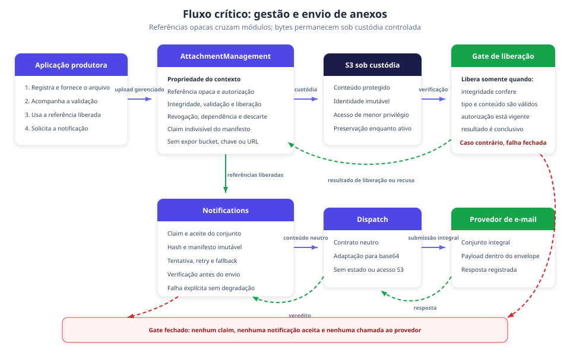

# Gestão de anexos do Notification Hub: especificação de desenvolvimento

**Status**: APPROVED  
**Especificação**: `SPEC-001`  
**Data**: 2026-08-31  
**Responsável**: Produto Notification Hub  
**Adaptador**: `dotnet`

## 1. Problema, objetivos e escopo

### Objetivo

Definir a arquitetura-alvo, as responsabilidades dos módulos, os contratos, as regras de engenharia e a estratégia de qualidade necessárias para incorporar anexos fornecidos pela aplicação cliente às notificações por e-mail, com custódia S3 do hub, isolamento por `application` e preservação do comportamento sem anexos.

### Problemas e oportunidades

| ID | Enunciado | Fonte ou evidência |
|---|---|---|
| `PROB-001` | Aplicações produtoras não conseguem solicitar pelo Notification Hub uma notificação que inclua anexos. A jornada precisa omitir o arquivo ou entregá-lo fora da capacidade central. | [PRD, seção Problema](../../../prd-attachment-management.md#problema) |
| `PROB-002` | Sem gestão central, o hub não aplica uniformemente isolamento, validação, integridade e evidência, nem demonstra que os bytes submetidos correspondem aos bytes validados. | [PRD, seção Problema](../../../prd-attachment-management.md#problema) |

### Objetivos e medidas de sucesso

| ID | Objetivo | Medida observável | Obrigatório | Proveniência e confiança | Validar ou revisar quando |
|---|---|---|---|---|---|
| `GOAL-001` | Permitir que uma aplicação autorizada associe anexos fornecidos por ela a uma notificação por e-mail sem transportar conteúdo na solicitação. | `MET-001`: 100% dos casos válidos da suíte chegam à aceitação do provedor com o conjunto correto. | sim | Decisão de produto no [PRD](../../../prd-attachment-management.md#objetivos-de-produto); confiança alta | A origem do conteúdo, o modelo de upload ou o canal inicial mudar. |
| `GOAL-002` | Garantir que somente anexos liberados, íntegros e pertencentes à aplicação solicitante sejam usados. | `MET-002`: zero violação do gate; `MET-006`: zero violação de isolamento na matriz entre aplicações. | sim | Decisão de produto no [PRD](../../../prd-attachment-management.md#objetivos-de-produto); confiança alta | O modelo de identidade, autorização ou liberação mudar. |
| `GOAL-003` | Preservar o conjunto completo durante tentativas, falhas e investigação, sem degradação silenciosa. | `MET-003`: zero degradação silenciosa; `MET-005`: 100% das tentativas aceitas pelo provedor são reconstruíveis. | sim | Decisão de produto no [PRD](../../../prd-attachment-management.md#objetivos-de-produto); confiança alta | O roteamento, fallback, provedor ou modelo de evidência mudar. |

### Não objetivos

- Gerar, converter, editar, assinar ou extrair conteúdo de documentos.
- Aceitar localização arbitrária no S3 ou manter a custódia na infraestrutura da aplicação cliente.
- Receber bytes ou base64 no contrato de solicitação da notificação.
- Entregar anexos por SMS, push ou WhatsApp na primeira produção.
- Substituir anexos automaticamente por links ou por mensagens sem arquivos.
- Gerenciar anexos estáticos de templates ou criar um portal público de compartilhamento.
- Extrair a capacidade para outro serviço ou alterar a macroarquitetura sem nova evidência.

## 2. Atores e jornadas

| ID | Ator e trabalho | Condição inicial | Resultado desejado | Proveniência e confiança | Validar ou revisar quando |
|---|---|---|---|---|---|
| `JRN-001` | Aplicação produtora registra o arquivo, realiza o upload, acompanha a validação e solicita a notificação. | Principal autenticado e autorizado para a `application`; conteúdo fornecido pela própria aplicação. | O hub aceita somente o conjunto liberado e submete ao provedor de e-mail exatamente os anexos aceitos, ou retorna falha explícita. | [PRD, Jornada de produto](../../../prd-attachment-management.md#jornada-de-produto); confiança alta | Evidência demonstrar que produtores não conseguem operar o fluxo em várias etapas. |
| `JRN-002` | Área operacional autorizada investiga o ciclo completo. | Notificação ou tentativa identificada e acesso autorizado à evidência. | Relacionar aplicação, identidade e integridade do anexo, validação, tentativa e resposta do provedor sem conteúdo bruto em logs ou eventos. | [PRD, Jornada de produto](../../../prd-attachment-management.md#jornada-de-produto); confiança alta | O modelo de auditoria ou a superfície de investigação mudar. |

## 3. Capacidades e aceitação de produto

| ID | Capacidade | Ator e valor | IDs de origem | Prioridade | Depende de | IDs de aceitação |
|---|---|---|---|---|---|---|
| `CAP-001` | Registro, upload e referência opaca | A aplicação fornece o arquivo sem expor o armazenamento aos demais fluxos. | `PROB-001`, `GOAL-001`, `JRN-001` | P0 | nenhuma | `PAC-001`, `PAC-004`, `PAC-011` |
| `CAP-002` | Validação e liberação segura | A aplicação sabe quando o arquivo pode ser usado e o destinatário fica protegido de conteúdo não liberado. | `PROB-002`, `GOAL-002`, `JRN-001` | P0 | `CAP-001` | `PAC-002`, `PAC-005`, `PAC-013`, `PAC-014` |
| `CAP-003` | Associação e aceite idempotente | A aplicação associa referências liberadas sem duplicar efeitos nem cruzar isolamento. | `PROB-001`, `PROB-002`, `GOAL-001`, `GOAL-002`, `JRN-001` | P0 | `CAP-002` | `PAC-002`, `PAC-004`, `PAC-008`, `PAC-009` |
| `CAP-004` | Submissão completa por e-mail | A aplicação obtém resultado explícito da submissão do conjunto completo ao provedor. | `PROB-001`, `PROB-002`, `GOAL-001`, `GOAL-003`, `JRN-001` | P0 | `CAP-003` | `PAC-003`, `PAC-006`, `PAC-013` |
| `CAP-005` | Ciclo de vida, operação e evidência | A área operacional acompanha proteção, entrega, recuperação e descarte. | `PROB-002`, `GOAL-003`, `JRN-002` | P0 | `CAP-002`, `CAP-004` | `PAC-007`, `PAC-010`, `PAC-011`, `PAC-012` |

| ID | Aceitação observável de produto |
|---|---|
| `PAC-001` | Uma aplicação autorizada inicia o upload, acompanha a validação por identificador opaco e só usa esse identificador em uma notificação após a liberação. |
| `PAC-002` | Uma solicitação com referência pendente, rejeitada ou inexistente é recusada antes de criar uma notificação aceita. |
| `PAC-003` | Uma tentativa bem-sucedida submete ao provedor de e-mail todos os anexos solicitados, e a evidência demonstra que os bytes submetidos correspondem aos bytes validados. |
| `PAC-004` | Uma aplicação não consulta nem usa uma referência pertencente a outra aplicação. |
| `PAC-005` | Um arquivo infectado, não verificável ou com resultado inconclusivo nunca é liberado nem enviado. |
| `PAC-006` | Quando o e-mail não preserva o conjunto completo, o fluxo termina com falha explícita e auditável, sem mensagem degradada em outro canal. |
| `PAC-007` | Uma consulta autorizada relaciona aplicação, anexo, integridade, validação, notificação, tentativa e provedor sem depender de conteúdo bruto em logs ou eventos. |
| `PAC-008` | Produtores existentes continuam solicitando notificações sem anexos por REST e Kafka, preservando o baseline brownfield. |
| `PAC-009` | Repetir a mesma chave idempotente com as mesmas referências e propriedades devolve o resultado original; alterar uma referência ou propriedade produz conflito e nenhum novo efeito. |
| `PAC-010` | Uma falha parcial em upload, validação ou liberação converge para estado recuperável ou descarte conhecido, sem produzir anexo utilizável sem validação. |
| `PAC-011` | O descarte de upload abandonado não remove nem torna indisponível um anexo ainda vinculado a uma notificação ativa. |
| `PAC-012` | A inspeção das superfícies produzidas pela suíte não encontra conteúdo bruto, localização S3 nem capacidade de upload em brokers, dead-letter, logs ou auditoria comum. |
| `PAC-013` | Uma liberação vencida ou revogada antes da tentativa impede a chamada ao provedor e produz resultado explícito. |
| `PAC-014` | Conteúdo com tipo divergente, metadado hostil ou estrutura não inspecionável é recusado sem liberar o anexo e sem expor o conteúdo na resposta. |

## 4. Rastreabilidade e integração entre capacidades

### Mapa de rastreabilidade

| Problema | Objetivo | Jornada | Capacidade | Aceitação de produto |
|---|---|---|---|---|
| `PROB-001` | `GOAL-001` | `JRN-001` | `CAP-001` | `PAC-001`, `PAC-004`, `PAC-011` |
| `PROB-002` | `GOAL-002` | `JRN-001` | `CAP-002` | `PAC-002`, `PAC-005`, `PAC-013`, `PAC-014` |
| `PROB-001`, `PROB-002` | `GOAL-001`, `GOAL-002` | `JRN-001` | `CAP-003` | `PAC-002`, `PAC-004`, `PAC-008`, `PAC-009` |
| `PROB-001`, `PROB-002` | `GOAL-001`, `GOAL-003` | `JRN-001` | `CAP-004` | `PAC-003`, `PAC-006`, `PAC-013` |
| `PROB-002` | `GOAL-003` | `JRN-002` | `CAP-005` | `PAC-007`, `PAC-010`, `PAC-011`, `PAC-012` |

### Dependências e ondas

| Capacidade | Razão da dependência | Habilitada por | Onda | Paralela com |
|---|---|---|---:|---|
| `CAP-001` | Estabelece identidade e ingresso. | nenhuma | 1 | preparação de contratos, segurança e rollout |
| `CAP-002` | Precisa de um anexo registrado para validar e liberar. | `CAP-001` | 2 | instrumentação do ciclo de vida |
| `CAP-003` | Só aceita referências cuja identidade e liberação existem. | `CAP-002` | 3 | evolução compatível de REST e Kafka |
| `CAP-004` | Precisa do conjunto aceito e vinculado à notificação. | `CAP-003` | 4 | adaptação do provedor e evidência da tentativa |
| `CAP-005` | Precisa dos resultados de validação e submissão para completar investigação e recuperação. | `CAP-002`, `CAP-004` | 5 | ensaios de rollout e descarte seguro |

### Integração entre capacidades

| Origem | Destino | Transferência ou estado compartilhado | Comportamento ponta a ponta | Aceitação |
|---|---|---|---|---|
| `CAP-001` | `CAP-002` | Identidade opaca e conteúdo recebido. | A validação examina o conteúdo associado à identidade registrada. | `PAC-001`, `PAC-005` |
| `CAP-002` | `CAP-003` | Referência liberada e identidade íntegra. | Somente referências liberadas participam do aceite. | `PAC-002`, `PAC-004` |
| `CAP-003` | `CAP-004` | Manifesto idempotente associado à notificação. | A submissão recebe exatamente o conjunto aceito e não o degrada. | `PAC-003`, `PAC-006`, `PAC-009` |
| `CAP-002` | `CAP-005` | Resultado da validação e transições de estado. | A investigação relaciona liberação ou rejeição ao anexo correto. | `PAC-005`, `PAC-007` |
| `CAP-004` | `CAP-005` | Tentativa, provedor e resultado. | A investigação reconstrói o manifesto submetido e o desfecho. | `PAC-007` |

## 5. Estado atual e estado-alvo

### Estado atual

O repositório é um monólito modular .NET 10. `Notifications` possui ingresso REST e Kafka, idempotência, pipeline, tentativas, fallback e rastreamento, e consome contextos irmãos somente por contratos publicados (`src/Platform.Api/Modules/Notifications/AGENTS.md:9-43`). `Dispatch` possui adaptadores de provedor e não possui estado de tentativa, fallback ou auditoria (`src/Platform.Api/Modules/Dispatch/AGENTS.md:5-25`).

O comando de ingresso não representa anexos (`src/Platform.Api/Modules/Notifications/Features/Ingress/RequestNotification/RequestNotification.Command.cs:7-36`), o hash vigente não inclui referências de arquivo (`src/Platform.Api/Modules/Notifications/Features/Ingress/RequestNotification/RequestNotification.PayloadHash.cs:13-32`), `EmailMessage` contém apenas assunto, preheader, HTML e texto (`src/Platform.Api/Modules/Dispatch/Integration/V1/RenderedMessage.cs:23-27`), e a forma SendGrid não contém anexos (`src/Platform.Api/Modules/Dispatch/Infrastructure/Providers/SendGrid/SendGridMailRequest.cs:10-15`). O guia do produtor limita o registro Kafka a 256 KB e proíbe anexos e dados de contato (`docs/guia-integracao-produtor.md:210-216`).

### Arquitetura-alvo

O monólito modular permanece, com um novo contexto `AttachmentManagement` e integração somente por contratos publicados e versionados. O fluxo crítico mantém conteúdo e localização do S3 fora dos ingressos de notificação, transportes, logs e evidência comum.

### Responsabilidade dos módulos

`AttachmentManagement` torna-se proprietário da referência opaca, custódia S3, identidade íntegra, validação, liberação, revogação, dependências ativas, recuperação e descarte. `Notifications` continua como proprietário do aceite, idempotência, manifesto aceito, tentativa e fallback. `Dispatch` recebe uma forma neutra de armazenamento e traduz a tentativa para o provedor, sem consultar S3, persistência ou estado do anexo.

A aplicação usa a superfície externa de `AttachmentManagement`. `Notifications` usa contrato publicado e versionado para reivindicar o conjunto completo, obter um snapshot imutável e revalidar a liberação antes do ponto de submissão. Mensagens internas transportam somente identificadores e estado mínimo. O conteúdo chega ao SendGrid apenas dentro do adaptador, na forma exigida pelo provedor.

## 6. Requisitos de engenharia

### Regras de domínio e limites afetados

| ID | Regra ou requisito | Capacidades | Limite ou proprietário | Critério verificável | Evidência ou fonte |
|---|---|---|---|---|---|
| `ER-001` | Preservar o monólito modular e isolar `AttachmentManagement` como proprietário, acessível somente por contratos publicados e versionados. | `CAP-001` a `CAP-005` | `AttachmentManagement`; fitness functions | Módulos irmãos alcançam somente a superfície publicada; domínio não depende de EF, AWS ou transporte; `Dispatch` não depende do novo módulo. | [Fronteiras de Notifications](../../../../src/Platform.Api/Modules/Notifications/AGENTS.md) e [Dispatch](../../../../src/Platform.Api/Modules/Dispatch/AGENTS.md) |
| `ER-002` | Expor registro, upload gerenciado e acompanhamento por referência pública opaca, sem revelar armazenamento ou credencial. | `CAP-001` | `AttachmentManagement` | Respostas, contratos, erros e logs não contêm bucket, chave, URL reutilizável ou credencial. | `PAC-001`, `PAC-012` |
| `ER-003` | Autorizar registro, acompanhamento, claim, consulta e uso pela combinação entre principal e `application`. | `CAP-001`, `CAP-003`, `CAP-005` | `AttachmentManagement` e ingresso de `Notifications` | A matriz principal A/B, aplicação A/B e referência A/B produz zero acesso cruzado e não permite enumeração. | `PAC-004`, `MET-006` |
| `ER-004` | Manter uma máquina de estados fail closed. Resultado rejeitado, inconclusivo, indisponível ou não inspecionável nunca alcança liberação. | `CAP-002` | `AttachmentManagement` | Cada transição inválida termina sem referência utilizável, claim ou chamada ao provedor. | `PAC-002`, `PAC-005`, `PAC-014` |
| `ER-005` | Fixar após a liberação uma identidade interna imutável composta por geração do objeto, SHA-256 e comprimento, sem prescrever o mecanismo S3. | `CAP-002`, `CAP-004` | `AttachmentManagement` | Substituir ou alterar o objeto depois da validação impede claim ou envio; o digest do payload capturado corresponde ao digest liberado. | `PAC-003`, `PAC-013` |
| `ER-006` | Reivindicar o conjunto de forma indivisível e tornar claim e aceite atomicamente consistentes no efeito observável. | `CAP-003` | Contrato `AttachmentManagement` para `Notifications` | Falha entre claim, notificação, idempotência, outbox, auditoria e commit nunca deixa notificação aceita sem claim integral; órfãos convergem. | `PAC-002`, `PAC-010` |
| `ER-007` | Manter bytes, base64, localização S3 e capacidades de upload fora de REST de notificação, Kafka, SQS, outbox, dead-letter, eventos, logs e auditoria comum. | `CAP-001`, `CAP-003`, `CAP-005` | Todos os contextos e transportes | Varredura com sentinelas encontra zero ocorrência proibida em todas as superfícies coletadas. | `PAC-012`, `MET-004` |
| `ER-008` | Incorporar referências e propriedades que alteram a entrega à forma canônica idempotente, preservando exatamente o hash vigente quando não há anexos. | `CAP-003` | `Notifications` | Mesmo manifesto retorna replay; diferença relevante retorna conflito sem efeito; vetores dourados atuais permanecem idênticos. | `PAC-008`, `PAC-009` |
| `ER-009` | Persistir o snapshot imutável do manifesto aceito e sua identidade íntegra para tentativa, retry, fallback e evidência. | `CAP-003`, `CAP-004`, `CAP-005` | `Notifications` | Toda tentativa usa o mesmo conjunto, nomes, tipos e identidades aceitos, sem consultar metadado mutável. | `PAC-003`, `PAC-007` |
| `ER-010` | Revalidar liberação, identidade e envelope imediatamente antes da chamada ao provedor. | `CAP-004` | `Notifications` | Vencimento, revogação, divergência, conjunto incompleto ou envelope excedido produz falha explícita e zero chamada. | `PAC-006`, `PAC-013` |
| `ER-011` | Evoluir o contrato de `Dispatch` com uma representação neutra de provedor e armazenamento, submetendo o conjunto integral. | `CAP-004` | `Dispatch.Integration` e adaptador SendGrid | O contrato não expõe tipos AWS ou estado interno; a captura do wire comprova conjunto, nome, tipo, digest e comprimento. | `PAC-003`, `PAC-006` |
| `ER-012` | Preservar no máximo uma chamada ao provedor por tentativa sob concorrência e redelivery, sem repetição cega após resultado ambíguo. | `CAP-004` | `Notifications` e `Dispatch` | Claims concorrentes geram no máximo uma chamada; falha após início sem veredito permanece explícita para reconciliação. | `src/Platform.Api/Modules/Dispatch/AGENTS.md:244-247`; `src/Platform.Api/Modules/Notifications/AGENTS.md:472-479`; `PAC-010` |
| `ER-013` | Impedir descarte enquanto houver dependência ativa e reconciliar falhas parciais de upload, validação, claim e liberação. Uma reserva ainda não confirmada conta como dependência ativa, assim como uma tentativa em `sending` ou `unknown`. | `CAP-001`, `CAP-002`, `CAP-005` | `AttachmentManagement` | Varredura de abandonados não remove anexo ativo; cada falha converge para estado recuperável ou descarte conhecido. | `PAC-010`, `PAC-011` |
| `ER-014` | Produzir evidência minimizada e reconstruível da identidade, validação, tentativa, payload e resposta do provedor. | `CAP-005` | `AttachmentManagement`, `Notifications` e contrato de `Audit` | 100% das tentativas aceitas pelo provedor são reconstruíveis e nenhuma evidência comum contém conteúdo bruto. | `PAC-007`, `MET-005` |
| `ER-015` | Fazer evolução, rollout e rollback de modo aditivo, preservando o caminho sem anexos e o processamento dos itens já aceitos. | `CAP-003`, `CAP-004`, `CAP-005` | Persistência e composição da plataforma | Desabilitar novos aceites mantém solicitações sem anexos e conclui ou falha explicitamente itens existentes; reversão lógica não apaga dados. | `PAC-008`, `MET-007` |
| `ER-016` | Escolher buffer, streaming ou spool somente depois de medir payload final, recursos de runtime, falhas e igualdade byte a byte. | `CAP-004`, `CAP-005` | `Dispatch`, `Notifications` e testes de performance | Uma sonda reproduzível compara os três braços e a opção promovida respeita o orçamento aprovado e limpa todos os recursos. | Risco de base64, Server GC e envelope do provedor |

### Stack e restrições

- Usar .NET 10, Minimal APIs, EF Core, PostgreSQL e o estilo de slices verticais já observado, sem introduzir mediator.
- Manter o monólito modular. Dependências entre módulos atravessam somente contratos publicados; domínios permanecem livres de infraestrutura.
- Usar S3 sob custódia do hub e KMS conforme o Stack Profile manual, sem reutilizar a Infrastructure interna do módulo `Audit`.
- Preservar Kafka e SQS como transportes de identificadores. O registro Kafka continua limitado a 256 KB e sem conteúdo de anexo. A proibição explícita de anexos publicada no guia de integração do produtor é superfície de mudança desta capacidade, e a tabela de motivos desse guia é verificada por função de adequação.
- Preservar o Stack Profile manual. A divergência `messaging-consumer-pattern: none` não é corrigida automaticamente.
- Tratar `telemetry: none` como ausência de decisão de plataforma, não como autorização para omitir as métricas obrigatórias da capacidade.
- Usar xUnit, Shouldly, NSubstitute, NetArchTest, `WebApplicationFactory` e Testcontainers de PostgreSQL, Redis, LocalStack e Kafka conforme o dialeto existente.

### Contratos e superfícies expostas

| Superfície | Consumidor e provedor | Pública ou entre limites | Forma e expectativa de compatibilidade | Artefato de contrato |
|---|---|---|---|---|
| Ciclo externo de anexos | Aplicação produtora e `AttachmentManagement` | pública | Registro, upload gerenciado e consulta de estado por referência opaca; nenhuma localização ou credencial de armazenamento. | Conteúdo inline nesta seção |
| Solicitação REST de notificação | Aplicação produtora e `Notifications` | pública | Coleção opcional de referências e propriedades de entrega; ausência preserva forma, validação, hash e resultado vigentes. | Conteúdo inline nesta seção |
| Solicitação Kafka | Produtor e `Notifications` | pública | Referências opacas e propriedades mínimas dentro do limite de 256 KB; adição só permanece em V1 se testes de contrato provarem compatibilidade. | Conteúdo inline nesta seção |
| `AttachmentManagement.Integration` | `Notifications` e `AttachmentManagement` | entre módulos | Claim indivisível, snapshot do manifesto, verificação de liberação e acesso controlado ao conteúdo; sem entidades, EF, S3 ou credenciais. | Conteúdo inline nesta seção |
| `Dispatch.Integration` | `Notifications` e `Dispatch` | entre módulos | Representação neutra do conjunto e ciclo de vida explícito dos recursos; V1 aditiva somente com prova, caso contrário versão coexistente. | Conteúdo inline nesta seção |
| Mensagens internas e outbox | API, worker e consumidores | entre processos | Somente IDs, referências opacas e estado mínimo; nunca bytes, base64, nomes desnecessários, chave ou URL S3. | Conteúdo inline nesta seção |
| Wire SendGrid | Adaptador SendGrid e provedor | externa | Payload final com conjunto integral, nome e tipo liberados e base64; envelope calculado antes da chamada. | Conteúdo inline nesta seção |
| Evidência de tentativa | `Notifications`, `AttachmentManagement` e `Audit` | entre módulos | Referência, digest, resultado de validação, tentativa e resposta do provedor, sem conteúdo bruto. | Conteúdo inline nesta seção |

### Segurança, privacidade e conformidade

- Tratar cada arquivo como entrada não confiável e potencialmente pessoal desde o registro até o descarte.
- Aplicar autorização por recurso e `application` em toda leitura, mutação, claim e uso. Respostas de consulta cruzada não revelam existência nem estado.
- Fixar a identidade do conteúdo liberado e impedir TOCTOU entre validação, claim, revogação, leitura e submissão.
- Manter indisponibilidade de autorização, S3, KMS ou validação como falha fechada. O comportamento fail open do rate limiter não se aplica a gates de segurança.
- Exigir proteção em repouso, acesso de menor privilégio e separação entre custódia, validação e envio, sem prescrever política IAM ou topologia antes da decisão técnica.
- Comparar o tipo efetivo do conteúdo ao tipo declarado e recusar metadado hostil, estrutura protegida ou não inspecionável conforme o catálogo aprovado.
- Minimizar respostas, logs, traces, métricas, eventos, dead-letter e auditoria. Conteúdo, localização, capacidade de acesso e digest desnecessário não atravessam essas superfícies.
- Preservar o objeto enquanto houver dependência ativa e executar descarte somente quando essa proteção puder ser demonstrada.

### Requisitos não funcionais

| NFR | Meta ou orçamento | Escopo | Proveniência e confiança | Fundamentação | Validar ou revisar quando | Linha de verificação |
|---|---|---|---|---|---|---|
| `NFR-001` | 100% das jornadas válidas da suíte submetem o conjunto correto. | Candidato a release | `MET-001`; confiança alta | Aceitação observável de produto. | O contrato ou provedor mudar. | `VER-003` |
| `NFR-002` | Zero referência não liberada, vencida, revogada, hostil ou não autorizada alcança o provedor. | Candidato a release | `MET-002`; confiança alta | Gate de segurança da primeira produção. | O ciclo de vida ou a validação mudar. | `VER-002`, `VER-005`, `VER-013`, `VER-014` |
| `NFR-003` | Zero remoção ou alteração silenciosa do conjunto aceito. | Roteamento, retry e fallback | `MET-003`; confiança alta | Preservação do conteúdo solicitado. | Um canal ou fallback for adicionado. | `VER-006` |
| `NFR-004` | Zero conteúdo bruto, localização S3 ou capacidade de upload nas superfícies coletadas. | Transportes, telemetria e auditoria comum | `MET-004`; confiança alta | Minimização e contenção de credenciais. | Uma nova superfície de saída for criada. | `VER-012` |
| `NFR-005` | 100% das tentativas aceitas pelo provedor são reconstruíveis. | Evidência operacional | `MET-005`; confiança alta | Prova dos bytes submetidos no limite observável do hub. | O provedor ou a evidência mudar. | `VER-007` |
| `NFR-006` | Zero violação na matriz entre aplicações. | Autorização e isolamento | `MET-006`; confiança alta | Isolamento por `application`. | O modelo de identidade ou delegação mudar. | `VER-004` |
| `NFR-007` | Zero regressão na suíte vigente de REST e Kafka sem anexos. | Compatibilidade brownfield | `MET-007`; confiança alta | Preservação do contrato existente. | Uma versão contratual for promovida. | `VER-008`, `VER-019` |
| `NFR-008` | Nenhuma estratégia de transferência é promovida sem baseline reproduzível, igualdade byte a byte e orçamento de runtime aprovado. | Leitura S3, base64, serialização e envio | Painel .NET e Server GC observado; confiança alta para a necessidade de medição | A evidência não sustenta uma escolha antecipada entre buffer, streaming e spool. | Envelope, concorrência, runtime ou provedor mudar. | `VER-020` |

### Qualidade, testes e funções de adequação

O [Plano de verificação](03-verification-plan.md) mapeia cada aceitação de produto, regra de engenharia e requisito não funcional a observável, oráculo, nível de verificação, gate e proprietário. A estratégia combina testes unitários, integração com infraestrutura descartável, contratos, segurança arquitetural, concorrência, resiliência, mutação e sonda de capacidade. As funções de adequação preservam os limites entre módulos e impedem dependências de `Dispatch` para S3, persistência ou tipos internos de `AttachmentManagement`.

## 7. Registro de aplicabilidade

| Família | Disposição | Evidência do gatilho ou justificativa | Seção inline ou artefato |
|---|---|---|---|
| ADR | `inline` | Claim, identidade imutável, S3/KMS, validação, transferência e versão contratual têm consequências duráveis. | Seção 8 |
| RFC | `inline` | REST e Kafka são contratos de produtores e exigem prova de compatibilidade ou coexistência. | Seções 6 e 8 |
| ATA | `not-applicable` | O painel técnico foi consultivo e não realizou decisão humana independente. | Este registro |
| Technical Design | `inline` | Ciclo de vida, fronteiras, reconciliação e fluxo de submissão atravessam módulos. | Seções 5 e 6 |
| Contracts | `inline` | OpenAPI, Kafka, contratos publicados e forma SendGrid são afetados. | Seção 6 |
| Domain discovery | `inline` | O novo contexto possui ciclo de vida, invariantes, políticas e integrações próprias. | Seção 6 |
| Performance / capacity | `inline` | Base64, S3, validação, concorrência e envelope pressionam memória e throughput. | `ER-016`, `NFR-008` e seção 8 |
| Privacy / Security | `inline` | Conteúdo não confiável, isolamento, TOCTOU, proteção e minimização exigem controles verificáveis. | Seção 6 |

## 8. Registro de decisões

| Decisão candidata | Disposição | Status | Responsável | Alternativas consideradas | Objeções ou dissenso | Decisão e consequência | Mecanismo de garantia | Evidência | Condição de revisão |
|---|---|---|---|---|---|---|---|---|---|
| Limite de contexto | `inline` | aceita | Produto Notification Hub e `dotnet-architect` | Novo `AttachmentManagement`; responsabilidade em `Notifications`; reutilização do armazenamento de `Audit` | Novo contexto adiciona contratos e coordenação. Reutilizar `Audit` viola propriedade e acopla custódias diferentes. | `AttachmentManagement` possui custódia, validação, referência e ciclo de vida; `Notifications` orquestra; `Dispatch` adapta o provedor. | Fitness functions e testes de contrato | [Initiative Brief](../../specification.md#proveniência-das-decisões) e fronteiras dos módulos | A custódia ou a macroarquitetura mudar. |
| Modelo de ingresso e custódia | `inline` | aceita | Produto Notification Hub | Upload gerenciado com S3 do hub; conteúdo inline; S3 da aplicação cliente | O fluxo em etapas aumenta trabalho do produtor. Inline aumenta envelope e superfície de ataque; S3 externo perde controle de custódia. | A aplicação fornece o arquivo por upload gerenciado e usa referência opaca liberada; S3 permanece sob controle do hub. | Contratos externos e testes de vazamento | [PRD, Direção de produto](../../../prd-attachment-management.md#direção-de-produto-deste-prd) | Evidência demonstrar inviabilidade do fluxo para produtores. |
| Consistência do claim | `inline` | condicionada à evidência antes de `SEED-005` | `dotnet-architect` | Transação compartilhada por contrato; reserva idempotente com compensação; reserva idempotente com confirmação carregada pela transação de aceite | A primeira aumenta acoplamento e trava o isolamento em READ COMMITTED por contrato de terceiro; a segunda, ao pé da letra, admite janela de aceite durável com claim ainda reservado; a terceira mantém o acoplamento em contrato mais mensagem e deixa como único órfão a reserva sem aceite. | Promover somente a alternativa que impeça aceite sem claim integral e demonstre convergência sob falhas injetadas. | Prova de falha entre claim, aceite, outbox e commit | Transação vigente de `Notifications` em `src/Platform.Api/Modules/Notifications/AGENTS.md:68-77` | O limite transacional ou o modelo de persistência mudar. |
| Versão dos contratos públicos e entre módulos | `inline` | condicionada à prova de compatibilidade antes de `SEED-006` | Produto Notification Hub e `dotnet-architect` | Membro opcional em V1; V2 coexistente | V1 reduz operação, mas pode quebrar serializadores; V2 reduz risco e amplia coexistência. | Usar V1 somente se REST, Kafka, OpenAPI, schemas e consumidores antigos tolerarem a adição; caso contrário, manter versões coexistentes. | Testes de contrato e fitness functions | [Guia de integração](../../../guia-integracao-produtor.md) e regra `Integration.V1` | Consumidores, serializadores ou política de versão mudar. |
| Igualdade do manifesto idempotente | `inline` | condicionada a corpus contratual antes de `SEED-006` | Produto Notification Hub e `dotnet-architect` | Ordem significativa ou normalizada; duplicatas aceitas ou recusadas; propriedades de nome e tipo incluídas ou excluídas | Normalização excessiva pode tratar entregas diferentes como iguais; forma estrita pode criar conflitos sem valor. | Publicar a semântica que preserve todas as propriedades capazes de alterar o envio e congelar vetores dourados antes da implementação. Manifesto ausente e manifesto vazio produzem a mesma forma canônica, porque o teste de presença por não nulidade já escreve coleção vazia para outro membro opcional e isso quebraria a unicidade do caminho sem anexos. | Golden tests e matriz de replay e conflito | `PAC-009`; `src/Platform.Api/Modules/Notifications/Features/Ingress/RequestNotification/RequestNotification.PayloadHash.cs:13-32` | Uma propriedade de entrega for adicionada. |
| Identidade e proteção do objeto | `inline` | condicionada a experimento antes de `SEED-003` | `dotnet-architect` | Versionamento S3; chave content-addressed; Object Lock; combinação | Cada opção altera custo, reversibilidade e operação. Chave ou ETag isolados não provam identidade. | Fixar geração imutável, SHA-256 e comprimento; selecionar o mecanismo que impeça ou detecte troca após validação. | Teste TOCTOU, IAM e KMS em ambiente descartável | `PAC-003`, `PAC-013`; `src/Platform.Api/Modules/Audit/Infrastructure/Worm/S3WormObjectStore.cs:22-37,44-53,61-80` comprova leitura por chave, SHA-256, comprimento e Object Lock, sem fixar versão S3 na identidade lida | O modelo de ameaça, retenção ou KMS mudar. |
| Validação e liberação | `inline` | condicionada a política executável antes de `SEED-004` | Produto Notification Hub e `dotnet-architect` | Provedores e topologias de scanner; revalidação por tempo ou evento; tratamento de conteúdo protegido | Falso positivo afeta entrega; falso negativo afeta segurança; indisponibilidade não pode abrir o gate. | O mecanismo promovido deve produzir resultado conclusivo, comparar tipo efetivo e falhar fechado para conteúdo hostil, protegido ou não inspecionável. | Fixtures hostis e falhas do scanner | `PAC-005`, `PAC-013`, `PAC-014` | O catálogo de tipos, ameaça ou validade mudar. |
| Transferência ao provedor | `inline` | condicionada a medição antes de `SEED-009` | `dotnet-architect` | Buffer; streaming; spool protegido | Buffer pressiona memória; streaming complica preflight e cancelamento; spool adiciona I/O e risco local. | Escolher após a sonda demonstrar orçamento de runtime, limpeza de recursos, envelope correto e igualdade byte a byte. | Performance runner e fake SendGrid | `ER-016`, `NFR-008` | Runtime, envelope, concorrência ou provedor mudar. |
| Roteamento com anexos | `inline` | condicionada ao contrato de produto antes de `SEED-006` | Produto Notification Hub | Restringir plano a e-mail; recusar plano cujo canal elegível não preserve anexos | O produtor não escolhe o canal atual; alterar a política pode mudar recusas e prioridade. | A alternativa selecionada deve terminar explicitamente quando o conjunto não puder ser preservado e nunca converter para link ou remover anexos. | Testes de contrato do plano e fallback | `PAC-006` e [guia de integração](../../../guia-integracao-produtor.md) | A primeira produção incluir outro canal. |
| Rollout e rollback | `inline` | condicionada ao ensaio de versões mistas antes de `SEED-012` | `dotnet-architect` | Migração destrutiva; migração aditiva com controles separados | Aditividade prolonga coexistência, mas preserva itens aceitos. | Promover a estratégia que publique leitores tolerantes antes de escritores, habilite upload e validação antes do aceite e separe novos aceites do processamento existente. | Ensaio de versões mistas e rollback | `ER-015`, `PAC-008` | O modelo de deploy ou persistência mudar. |

## 9. Riscos e premissas sustentadas

| Tipo | Item | Evidência | Proprietário | Mitigação ou condição de revisão |
|---|---|---|---|---|
| Risco | Corrida entre liberação, claim, revogação, descarte e início da submissão. | `PAC-010`, `PAC-011`, `PAC-013` | `AttachmentManagement` e `Notifications` | Identidade imutável, claim indivisível, barreiras concorrentes e reconciliação. |
| Risco | O REST atual autoriza por classe sem provar vínculo do principal à `application`. | `src/Platform.Api/Modules/Notifications/Features/Ingress/RequestNotification/RequestNotification.Endpoint.cs:45-54`; `src/Platform.Api/Modules/Notifications/Infrastructure/Authorization/ProducerAuthorization.cs:36-52` | `Notifications` e `AttachmentManagement` | Introduzir autorização por recurso e executar matriz cruzada antes do rollout. |
| Risco | Envelope efetivo do provedor pode ser excedido após base64 e JSON. | Forma SendGrid atual e `ER-016` | `Dispatch` | Calcular o payload final antes da chamada e medir contra o contrato efetivo. |
| Risco | Buffering concorrente pode pressionar heap e Server GC. | `src/Platform.Api/Platform.Api.csproj:7`; base64 amplia a representação | `Dispatch` e `Notifications` | Comparar buffer, streaming e spool sob carga e cancelamento. |
| Risco | Falhas parciais podem criar upload, liberação ou claim órfão. | `PAC-010` | `AttachmentManagement` | Operações idempotentes, outbox quando aplicável e reconciliador verificável. |
| Risco | Timeout após início do POST pode deixar o resultado do provedor ambíguo. | `src/Platform.Api/Modules/Dispatch/AGENTS.md:244-247` | `Dispatch` e `Notifications` | Preservar estado explícito e não reenviar cegamente. |
| Risco | Uma tentativa estacionada em `unknown` mantém dependência ativa sobre o conjunto pelo horizonte da reconciliação de entrega, que hoje roda a cada 24 horas com corte de 6 horas. | `src/Platform.Api/appsettings.json:45-51` | `Notifications` e `AttachmentManagement` | Tratar `sending` e `unknown` como dependência viva em `ER-013` e rever o intervalo se o descarte exigir horizonte menor. |
| Risco | Conteúdo, nome, digest, chave ou capacidade de acesso pode vazar em superfícies operacionais. | `PAC-012`, `MET-004` | Todos os contextos afetados | Minimização por contrato, sentinelas e varredura de superfícies. |
| Risco | Mudança aditiva aparente pode quebrar consumidores antigos de REST ou Kafka. | Baseline brownfield e regra de coexistência | `Notifications` | Testes de contrato com consumidores antigos e versão coexistente quando necessário. |
| Premissa | S3 e KMS permanecem eixos técnicos disponíveis no host .NET. | [Stack Profile manual](../../../../.araia/stack-profile.yaml) e referências de pacote no projeto da API | Adaptador `dotnet` | Revisar se o Stack Profile ou a plataforma de execução mudar. |

## 10. Referências

- [Initiative Brief da SPEC-001](../../specification.md).
- [PRD de gestão de anexos](../../../prd-attachment-management.md).
- [Guia de integração do produtor](../../../guia-integracao-produtor.md).
- [Design proposto do Notification Hub](../../../notification-hub-system-design.md).
- [Fronteira do módulo Notifications](../../../../src/Platform.Api/Modules/Notifications/AGENTS.md).
- [Fronteira do módulo Dispatch](../../../../src/Platform.Api/Modules/Dispatch/AGENTS.md).
- [Stack Profile manual](../../../../.araia/stack-profile.yaml).
