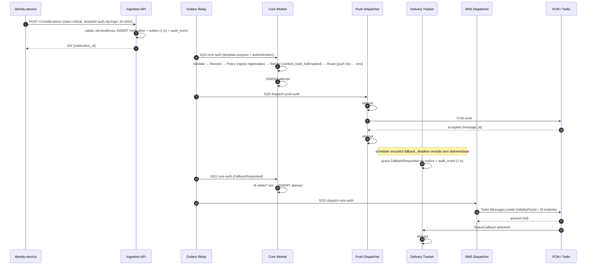
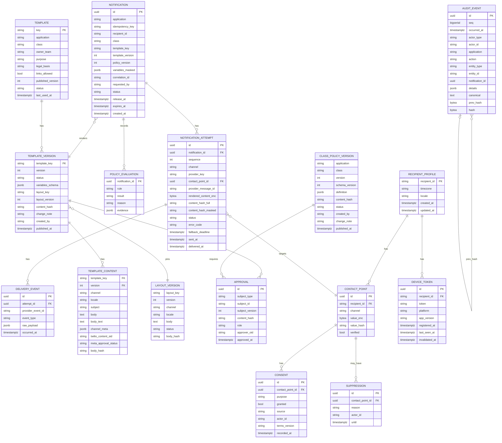
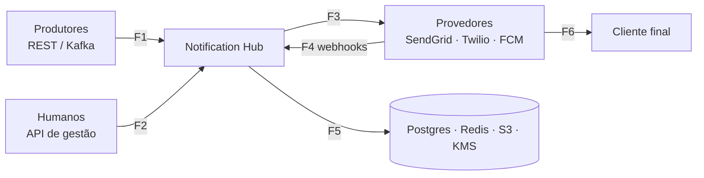

# Notification Hub — Design de Sistema

**Plataforma centralizada de notificações (E-mail, SMS, Push, WhatsApp) para fintech**
Status: Proposta para revisão · Contexto: ARAIA / ARAIA Câmbio (AWS/EKS, .NET 10)

---

## 0. Como ler este documento

| Seção | Para quem | O que responde |
|---|---|---|
| 1–3 | Todos | Por que existe, o que entra e o que não entra, como classificamos notificações |
| 4–7 | Engenharia | Arquitetura, fluxos, modelo de dados, contratos |
| 8 | Engenharia / SRE | Confiabilidade sobre Kafka (integração) e SQS (filas internas) |
| **9** | **Compliance / Segurança / Arquitetura** | **Governança e Auditoria** — quem pode mudar o quê, como provamos o que foi enviado |
| **10** | **Segurança** | **Modelo de ameaças, controles por ameaça, kill switches, hardening, SDLC seguro, resposta a incidentes, LGPD** |
| **11** | **Engenharia / SRE** | **Performance e capacidade** — orçamento de latência, caminho quente, escala, degradação, testes de carga |
| 12 | SRE | Observabilidade |
| 13–16 | Arquitetura / Liderança | Decisões, stack, roadmap, riscos |

Premissa que atravessa tudo: **provedor de canal é detalhe de implementação, reversível**. Nenhum produtor de notificação sabe se o SMS vai pela Twilio ou por outro fornecedor. E **nenhum texto chega ao cliente sem versão, aprovação e trilha**.

---

## 1. Contexto e objetivos

### 1.1 Problema

Cada serviço (câmbio, KYC, onboarding, cobrança, segurança) tende a resolver notificação localmente: chama o provedor direto, tem seu próprio template, não respeita preferência do cliente, não registra auditoria uniforme. Em fintech isso gera três dores concretas:

1. **Risco regulatório**: impossível provar ao BCB/ANPD *o que* foi enviado, *quando*, *para quem*, *com qual base legal* e *quem aprovou aquele texto*.
2. **Experiência inconsistente**: cliente recebe OTP por SMS num fluxo e por e-mail em outro.
3. **Custo e acoplamento**: contratos de provedor espalhados, sem fallback, troca de fornecedor vira projeto de meses.

### 1.2 Objetivos

- Dois pontos de entrada equivalentes para todo envio ao cliente final: `POST /v1/notifications` (síncrono) e o tópico Kafka `notifications.requested.v1` no barramento corporativo (assíncrono). Mesmo contrato, mesma validação, mesma trilha.
- Roteamento por **classe** (`critical`, `transactional`, `operational`) com SLA, fallback e política de consentimento por classe.
- **Templates geridos no hub, nunca em código**: versionados, imutáveis após publicação, com validação automática integral, render de teste por API, publicação em quatro olhos (quem publica não é o autor da versão) e rollback auditável por republicação. Para WhatsApp, espelhados nos templates aprovados pela Meta (via Twilio Content API).
- **Auditoria reconstrutível**: dado um `notification_id`, provar quem pediu, por qual base legal, qual texto exato (versão + conteúdo), por qual canal/provedor, o que o provedor respondeu, e quem consultou isso depois.
- Fronteira clara de PII: produtores enviam `recipient_id`, nunca telefone/e-mail.
- Multi-aplicação: ARAIA e ARAIA Câmbio com isolamento de templates, quotas, credenciais e trilhas.

### 1.3 Fora de escopo

- **Marketing e campanhas** (lotes, segmentação, janela de silêncio para promoções, frequency cap promocional, A/B). A taxonomia reserva a classe, mas nada é implementado. Quando entrar, entra como classe nova com fila própria, sem alterar o core.
- Notificações in-app / inbox.
- Atendimento conversacional inbound via WhatsApp. O hub trata WhatsApp apenas como saída, com captura de respostas simples (`SAIR`/`STOP`).
- Console administrativo de **operação** (provedores, DLQ, quotas): fica em Terraform/CLI. A gestão de templates, layouts e políticas é feita exclusivamente via API REST (§4.3, §7.4); o **Template Studio** (UI interna) não faz parte da v1 e está registrado como evolução no roadmap (§15).

---

## 2. Requisitos

### 2.1 Funcionais

| ID | Requisito |
|---|---|
| RF-01 | Aceitar solicitação síncrona (REST minimal API) e assíncrona (evento no barramento Kafka corporativo). |
| RF-01a | Publicar os eventos de resultado (`Delivered`, `Rejected`, `Failed`, `ContactSuppressed`, `ConsentChanged`) no mesmo barramento Kafka, para consumo por qualquer domínio. |
| RF-02 | Resolver `recipient_id` em pontos de contato (e-mail, telefone, device tokens, opt-in WhatsApp). |
| RF-03 | Aplicar política por classe: consentimento, canais elegíveis, supressão, janela de silêncio (só `operational`), dedupe. |
| RF-04 | Renderizar template versionado por canal e locale, com variáveis validadas por JSON Schema. |
| RF-05 | Rotear para canal primário e executar **fallback declarativo** (ex.: push → SMS após 30 s). |
| RF-06 | Receber webhooks de status (Twilio, SendGrid) e manter máquina de estados por tentativa. |
| RF-07 | Idempotência por `(application, idempotency_key)` com janela de 24 h. |
| RF-08 | Agendamento (`scheduled_at`) e expiração (`ttl`) — OTP expirado nunca é enviado. |
| RF-09 | Opt-out e consentimento por finalidade e canal, em ledger append-only. |
| RF-10 | Supressão automática: hard bounce, número inválido, token FCM `UNREGISTERED`. |
| RF-11 | Consulta (REST) de status e histórico por `notification_id`, `recipient_id`, `correlation_id`. |
| RF-12 | Isolamento por `application` em templates, quotas, credenciais e trilha de auditoria. |
| **RF-13** | **Trilha de auditoria imutável** de decisões de política, renderização, tentativas, entregas, consentimento, mudanças de configuração e acessos a dados auditados. |
| **RF-14** | **Publicação de template e de política segue quatro olhos**: quem publica não pode ser o autor da versão, com registro transacional de quem publicou (`approval` + `audit_event`). Aprovação dupla por classe (técnica + compliance) é ponto de extensão ativável por exigência de Compliance. |
| **RF-15** | Reconstrução do conteúdo exato entregue ao cliente, a partir do `notification_id`, por todo o período de retenção. |
| **RF-16** | **Gestão do ciclo de vida de templates no hub, exclusivamente via API REST**: criar, editar rascunho (`PUT` + `ETag`), validar, executar render de teste, publicar com quatro olhos, depreciar, desabilitar, reverter por republicação. Nenhum template existe em código. |
| **RF-17** | Publicação por ambiente: cada ambiente publica seus templates via API pelo seu próprio pipeline. Promoção entre ambientes por bundle é ponto de extensão, fora da v1. |
| **RF-18** | Detecção de templates órfãos (sem uso em N dias), com alerta ao owner. Revisão periódica (`review_due`) é ponto de extensão, fora da v1. |

### 2.2 Não funcionais

| Atributo | Meta v1 | Observação |
|---|---|---|
| Latência, classe **critical** | p95 ≤ 5 s, p99 ≤ 8 s até `sent` no provedor | Do `accepted` ao `sent`; orçamento por estágio em §11.2 |
| Latência da ingestão (REST) | p99 ≤ 50 ms | Uma transação no banco, nenhuma chamada externa além do Redis (idempotência e rate limit), que falha aberto |
| Latência, classe **transactional** | p95 ≤ 30 s | |
| Latência, classe **operational** | p95 ≤ 5 min | Respeita janela de silêncio |
| Throughput sustentado | 300 msg/s; pico 1.000 msg/s | Sem marketing, o pico vem de eventos de mercado (alerta de câmbio em massa) |
| Cenário de burst de referência | 50k alertas `critical` em 5 min (~170/s) **simultâneo** a 50 OTPs/s | Sem degradar o p95 de OTP: a garantia sob burst de `critical` é o isolamento pelas filas `-auth` dedicadas (§4.2, §11.5), não a prioridade por classe |
| Abuso | Produtor comprometido limitado a N msg/s por principal e N por destinatário | §10.2 ameaça A1; kill switch por produtor |
| Disponibilidade da ingestão | 99,95 % | Aceitar e persistir antes de qualquer inteligência |
| Durabilidade | Zero perda após `202 Accepted` | Outbox + SQS |
| Integridade da auditoria | Verificável criptograficamente | Hash chain + export WORM (§9.4) |
| Retenção de auditoria | Definir com Jurídico; assumir ≥ 5 anos | Conteúdo cifrado, PII mascarada |
| RTO / RPO | 15 min / 1 min | Sustentados pela estratégia de DR em §8 |

### 2.3 Regulatórios e de mercado (Brasil)

- **LGPD (Lei 13.709/2018)**: base legal por classe, registrada no catálogo de templates; consentimento demonstrável; direito de oposição; minimização; retenção definida.
- **Resolução CMN 4.893/2021** (segurança cibernética): rastreabilidade, controle de acesso, gestão de terceiros — Twilio e SendGrid são terceiros relevantes: exigir cláusulas de segurança, localização de dados e notificação de incidente.
- **Prevenção a phishing**: sem encurtadores; links só em domínio próprio; SMS/WhatsApp de OTP nunca contêm link; remetente registrado por número longo ou short code BR (operadoras brasileiras não entregam sender ID alfanumérico; pendente de confirmação nas country guidelines da Twilio); conta WhatsApp Business verificada.
- **E-mail**: SPF, DKIM, DMARC `p=reject`; subdomínio dedicado (`mail.`) com domínio autenticado no SendGrid.
- **WhatsApp Business Platform**: mensagens iniciadas pela empresa exigem template aprovado pela Meta (submetido via Twilio Content API), categorizado (`authentication` / `utility`); opt-in explícito documentado; precificação da Meta tratada como configuração.

---

## 3. Taxonomia de notificações

| Classe | Exemplos | Canais elegíveis | Fallback | Opt-out? | Janela de silêncio | Base legal |
|---|---|---|---|---|---|---|
| **critical** | OTP, alerta de login novo, confirmação de operação de câmbio, bloqueio de conta | push, SMS, WhatsApp (`authentication`) | 30 s | Não | Não se aplica | Execução de contrato / obrigação legal |
| **transactional** | Status de pedido, comprovante, documento KYC aprovado, boleto emitido | e-mail, push, WhatsApp (`utility`) | 5 min | Parcial: escolhe canal, não desliga | Não se aplica | Execução de contrato |
| **operational** | Pendência de documento, vencimento de cadastro, manutenção programada | e-mail, push | 1 h | Parcial | 21h às 8h, no fuso de `RECIPIENT_PROFILE` (§4.3) | Legítimo interesse |
| *marketing* | *— fora de escopo —* | | | | | |

Regras derivadas:

- **E-mail nunca é canal primário para `critical`**. Pode ser último fallback para alerta de segurança, nunca para OTP.
- **SMS é reservado para `critical`**; liberar para outras classes exige mudança de política aprovada (§9.2).
- Cada classe tem fila própria por canal (bulkhead): pico de `operational` nunca atrasa um OTP. Templates com `purpose = authentication` usam adicionalmente as filas `-auth` dedicadas (§4.2): é o isolamento por fila, não a prioridade por classe, que protege o OTP sob burst de `critical`.

---

## 4. Arquitetura

### 4.1 Visão de contexto

```mermaid
flowchart LR
  subgraph Producers["Produtores (domínios de negócio)"]
    CAMBIO[araia-cambio-api]
    KYC[kyc-service]
    AUTH[identity / auth]
    BILL[billing]
  end

  subgraph Kafka["Barramento Kafka corporativo"]
    KIN[(notifications.requested.v1)]
    KOUT[(notifications.events.v1)]
    KDLT[(notifications.requested.dlt)]
    KCON[(contacts.events.v1)]
  end

  subgraph Msg["SQS — filas de trabalho internas"]
    SQSCORE{{core-&#123;class&#125; + core-auth<br/>4 filas}}
    SQSDISP{{dispatch-&#123;channel&#125;-&#123;class&#124;auth&#125;<br/>16 filas}}
  end

  subgraph Hub["Notification Hub (EKS)"]
    API[Ingestion API<br/>minimal API]
    ING[Kafka Ingress Worker<br/>consumer group notification-hub-ingress]
    RELAY[Outbox Relay Worker]
    CORE[Core Worker<br/>pipeline de estágios]
    CONTACT[(Contact & Consent)]
    TPL[(Template Management<br/>templates · layouts · políticas)]
    DB[(PostgreSQL<br/>notifications + outbox + audit)]
    WEMAIL[Email Dispatcher]
    WSMS[SMS Dispatcher]
    WPUSH[Push Dispatcher]
    WWA[WhatsApp Dispatcher]
    TRACK[Delivery Tracker<br/>webhooks + scheduler]
    MGMT[Management & Query API<br/>minimal API REST]
    AUD[(Audit Store<br/>append-only + S3 WORM)]
  end

  subgraph Providers
    SG[SendGrid]
    TW[Twilio Messaging<br/>SMS + WhatsApp]
    FCM[FCM HTTP v1]
  end

  AUTH & CAMBIO -->|REST| API
  KYC & BILL -->|produce| KIN --> ING
  CAMBIO -.->|produce, fase 1b| KIN
  KCON --> ING
  ING -.poison.-> KDLT
  API & ING --> DB
  DB --> RELAY --> SQSCORE --> CORE
  CORE <--> CONTACT & TPL
  CORE --> DB
  RELAY --> SQSDISP --> WEMAIL & WSMS & WPUSH & WWA
  WEMAIL --> SG
  WSMS & WWA --> TW
  WPUSH --> FCM
  SG & TW -->|webhook| TRACK
  TRACK --> DB
  RELAY --> KOUT
  KOUT --> KYC & BILL & CAMBIO
  CORE & TRACK & API --> AUD
  MGMT --> DB & AUD & TPL
  TPL -.submete Content template.-> TW
```



### 4.2 Topologia de mensageria

Dois sistemas, dois papéis, sem sobreposição:

- **Kafka (barramento corporativo)** — integração com os domínios: entrada de solicitações e saída de eventos de resultado. É onde os outros serviços já estão.
- **SQS (interno ao hub)** — filas de trabalho entre os workers do hub: precisam de *delay* por mensagem, *visibility timeout*, DLQ por mensagem, escala por profundidade e retry individual — semântica de fila, que Kafka (um log) não oferece sem reinventar.

| Recurso | Tipo | Função | Configuração |
|---|---|---|---|
| `notifications.requested.v1` | Kafka topic | Entrada assíncrona dos produtores | Key = `recipientId`; partições dimensionadas para o pico (ex.: 12); retenção 24 h (ver §7.2; pode conter variáveis); `cleanup.policy=delete`; ACL de escrita por principal de produtor |
| `notifications.requested.dlt` | Kafka topic | Dead-letter de entrada (mensagens permanentemente inválidas) | Headers com erro, tópico/partição/offset de origem; retenção 14 dias; alarme por taxa |
| `notifications.events.v1` | Kafka topic | Saída: `Delivered`, `Rejected`, `Failed`, `ContactSuppressed`, `ConsentChanged` | Key = `recipientId`; header `eventType` para filtro; sem PII; retenção 7 dias |
| `contacts.events.v1` | Kafka topic | Entrada de contatos, consentimentos e device tokens para o módulo Contact & Consent (ADR-0012) | CloudEvents; emissor: sistema de cadastro; mesmo padrão at-least-once do ingress, dedupe em `processed_messages` |
| `core-{critical\|transactional\|operational}` e `core-auth` | SQS standard (4) | Entrada do Core Worker, por classe; `core-auth` quando `template.purpose = authentication` | Alimentadas pelo Outbox Relay |
| `dispatch-{email\|sms\|push\|whatsapp}-{class}` e `dispatch-{channel}-auth` | SQS standard (16) | Entrada dos dispatchers; filas `-auth` para templates de autenticação | `DelaySeconds` por mensagem para `scheduled_at` ≤ 15 min; DLQ por fila |
| `*-dlq` | SQS standard | Dead-letter interno | Retenção 14 dias; alarme CloudWatch por profundidade |

Não existe mais SNS de entrada nem de saída: dois caminhos assíncronos para a mesma coisa é superfície duplicada. Se surgir um produtor sem acesso ao Kafka, ele usa REST.

**Kafka Ingress Worker** (detalhe em §7.2):

- `Confluent.Kafka`, consumer group `notification-hub-ingress`, `enable.auto.commit=false`, commit **depois** de persistir `notification` + `outbox` + `audit_event` na mesma transação (at-least-once).
- Idempotência em duas camadas: `processed_messages` por `(topic, partition, offset)` cobre reprocessamento após rebalance; `(application, idempotency_key)` cobre reenvio pelo produtor.
- Erro **transitório** (banco indisponível): retry em processo com backoff; se persistir, `Pause()` da partição e alarme (page quando a pausa passa de 5 min). Não há commit e a mensagem permanece no tópico, mas a retenção de 24 h impõe um limite real: mensagem não consumida é apagada, e indisponibilidade prolongada do ingress causa perda. Controles: alarme de partição pausada por mais de 5 min e objetivo de restauração do ingress ≤ 1 h, muito menor que a retenção. Erro **permanente** (envelope inválido, `application`/classe não autorizados para o principal, template inexistente, variáveis fora do schema): produz na `.dlt` com headers de diagnóstico, publica `NotificationRejected` em `notifications.events.v1`, grava `audit_event`, commita. Ordem da partição é preservada em ambos os casos.
- Escala por *consumer lag* (KEDA Kafka scaler), limitada ao número de partições.
- Backpressure natural: se as filas SQS internas estiverem saturadas, o worker reduz o ritmo de consumo (`Pause`/`Resume`) em vez de acumular em memória.

Decisões que o MassTransit fazia e agora são nossas:

- **Outbox → fila/tópico**: um `Outbox Relay Worker` lê `outbox` (em lotes, `FOR UPDATE SKIP LOCKED`), publica no destino da linha — SQS via `SendMessageBatch` ou Kafka via producer idempotente (`acks=all`, `enable.idempotence=true`) — e marca como enviado. At-least-once; dedupe no consumidor.
- **Consumidor idempotente**: tabela `processed_messages(message_id, consumer, processed_at)` verificada na mesma transação do efeito. Usa o `MessageId` do SQS **e** a chave de negócio da mensagem.
- **Retry com backoff**: consumidor chama `ChangeMessageVisibility` com delay exponencial + jitter em erro transitório; erro permanente → `DeleteMessage` + registro de falha (não vai para DLQ). DLQ fica só para o inesperado.
- **Prioridade**: SQS não tem. Cada dispatcher faz *weighted polling* na ordem `auth > critical > transactional > operational` (§11.5): drena a fila `-auth` antes de qualquer outra, depois `critical`; `transactional` e `operational` em rodízio 3:1. Cada fila tem seu próprio scaler KEDA.
- **Agendamento**: `DelaySeconds` até 15 min; além disso (`scheduled_at` distante, janela de silêncio) o Core grava `release_at` e um scheduler DB-backed (§4.3, Delivery Tracker) libera. Uniforme, auditável, sem EventBridge.
- **Ordem**: não exigida; filas standard. Se um fluxo precisar ordem por cliente, troca-se a fila específica por FIFO com `MessageGroupId = recipient_id`. A abstração de consumidor é a mesma, mas a troca não é transparente: FIFO não tem `DelaySeconds` por mensagem, tem limite de mensagens em voo por fila, throughput limitado por grupo e consumo serializado por `MessageGroupId`.

Biblioteca: `AWSSDK.SQS` / `AWSSDK.SimpleNotificationService` direto, envolvidos num `SqsConsumer<T>` interno (long polling 20 s, batch 10, concorrência configurável, delete seletivo apenas das mensagens processadas com sucesso). Pequeno, testável, sem dependência de framework de mensageria.

**Mensagens internas (claim check).** Nenhum conteúdo sensível trafega nas filas internas: as mensagens carregam referências e cada estágio lê o estado no banco (custo de uma leitura extra por estágio, dentro do orçamento de §11.2). Envelope comum versionado: `messageId`, `type`, `schemaVersion`, `occurredAt`, `traceparent`, `priorityClass`, `payload`.

| Fila | `payload` |
|---|---|
| `core-{class}` e `core-auth` | `{ notificationId }`; o Core lê `NOTIFICATION` do banco |
| `dispatch-{channel}-{class}` e `dispatch-{channel}-auth` | `{ notificationId, attemptId }`; o dispatcher lê o attempt e `rendered_content_enc` do banco |

Gatilho de fallback: mensagem `type = FallbackRequested`, `payload = { notificationId, failedAttemptId }`, gravada pelo Delivery Tracker **via outbox** e roteada para a fila `core-*` correspondente (§5.1, §5.2).

### 4.3 Componentes

#### Ingestion API (minimal API)
- `POST /v1/notifications` → valida schema, verifica idempotência no escopo `(application, idempotency_key)`, aplica o rate limit por principal e por destinatário (na ingestão; em falha do Redis, fail-open com alarme, §10.2 A1), **persiste `notification` + `outbox` na mesma transação**, devolve `202`. Nada mais.
- AuthN via **Entra ID**: client credentials (preferir certificado a secret), token validado com `Microsoft.Identity.Web`; autorização por **app roles** da app registration do hub: `Notifications.Send.Critical`, `Notifications.Send.Transactional`, `Notifications.Send.Operational`. Um serviço de billing não consegue pedir `critical`.
- O Kafka Ingress Worker faz exatamente o mesmo (mesmo validador, mesma transação, mesma auditoria) para mensagens de `notifications.requested.v1`, com autorização baseada no principal Kafka do produtor (§7.2).

#### Core Worker — pipeline de estágios
Sem Railway-oriented. Um `NotificationContext` mutável atravessa uma lista ordenada de estágios; cada estágio devolve `StageOutcome`:

```csharp
public enum StageOutcome { Continue, Reject, Defer }

public interface INotificationStage
{
    string Name { get; }
    Task<StageOutcome> ExecuteAsync(NotificationContext ctx, CancellationToken ct);
}

public sealed class NotificationPipeline(IReadOnlyList<INotificationStage> stages)
{
    public async Task RunAsync(NotificationContext ctx, CancellationToken ct)
    {
        foreach (var stage in stages)
        {
            var outcome = await stage.ExecuteAsync(ctx, ct);
            ctx.Trace.Add(stage.Name, outcome, ctx.LastReason);   // vai para a auditoria
            if (outcome != StageOutcome.Continue) break;
        }
        await ctx.CommitAsync(ct);   // notification + attempts + outbox + audit_event na mesma transação
    }
}
```

Contrato mínimo de `NotificationContext`: além do estado da notificação e de `Trace`, expõe `LastReason` (string com o motivo da última decisão de estágio), preenchido pelo estágio antes de devolver `Reject` ou `Defer`.

Estágios, em ordem:

1. **Validate** — `ttl`, template publicado para a `application`, variáveis contra JSON Schema.
2. **Resolve** — `recipient_id` → pontos de contato. Aqui nasce a PII.
3. **Policy** — carrega a configuração de classe publicada para `(application, class)` e executa a lista de regras do estágio (§4.3 "Políticas"): elegibilidade de canal, consentimento por finalidade, supressão, dedupe, janela de silêncio (`Defer` com `release_at`). Cada regra é uma implementação de `IPolicyRule` e registra seu resultado — **a decisão de política é auditável regra a regra** (§9.3).
4. **Render** — versão `published` do template × canal × locale × variáveis, com a versão de layout fixada pela versão do template; mascaramento obrigatório de variáveis `sensitive`; grava `content_hash_full` e `content_hash_masked` (§10.2 A4).
5. **Route** — plano de entrega (primário + cadeia de fallback com timeouts) vindo da configuração de classe publicada, filtrado pelos canais que sobreviveram ao estágio 3.
6. **Commit** — transação única.

Exceções inesperadas não são "tratadas" no pipeline: propagam, a mensagem volta à fila com backoff, e após `maxReceiveCount` vai à DLQ. Rejeição de negócio é `Reject` explícito, nunca exceção.

#### Contact & Consent (ADR-0012)
- **Módulo interno do hub**: mesmo processo, mesmo Postgres. Não existe serviço remoto separado na v1; o modo degradado é cache *stale-while-revalidate* sobre consulta local, não timeout de rede.
- Fonte da verdade: tabelas do hub `RECIPIENT_PROFILE`, `CONTACT_POINT`, `CONSENT`, `DEVICE_TOKEN` (§6).
- `RECIPIENT_PROFILE` guarda `timezone` (IANA; ausente = `America/Sao_Paulo`) e `locale`: é o dado que alimenta `quietHours` (§3, §4.3 "Políticas").
- `DEVICE_TOKEN` registra os tokens de push por dispositivo; invalidação por `UNREGISTERED`/`INVALID_ARGUMENT` do FCM.
- Caminhos de escrita: REST (`PUT /v1/recipients/{id}/contact-points`, `PUT /v1/recipients/{id}/consents`, `POST /v1/recipients/{id}/devices`, com scope dedicado `contacts.write`, §7.4) e Kafka (tópico `contacts.events.v1`, CloudEvents, emissor: sistema de cadastro; mesmo padrão at-least-once do ingress, dedupe em `processed_messages`). Toda escrita gera `audit_event` na mesma transação.
- Opt-in WhatsApp: registrado como `CONSENT` com `channel = whatsapp` e campo `source` (app, atendimento, importação).
- Consentimento **append-only**: origem (app, atendimento, importação), dispositivo/IP quando houver, versão do termo, timestamp, ator. Nunca sobrescreve.
- Eventos de invalidação de cache `ContactChanged`/`ConsentChanged`: emitidos **pelo próprio módulo** via outbox, consumidos pelos caches locais dos workers.

#### Template Management (o coração da governança)

Templates **nunca vivem em código**: nem no hub, nem nos produtores, nem em repositório Git. São dados geridos pelo hub, com ciclo de vida próprio, editados por quem é dono do texto (Produto, Compliance, Atendimento) exclusivamente pela API REST da superfície única (ADR-0007, autenticada via Entra, §7.4) e consumidos pelo Core somente quando `published`. O produtor referencia `templateKey`; o hub decide a versão e registra qual usou. A v1 mantém o essencial da gestão; cada corte é um ponto de extensão nomeado, com o mesmo critério de retorno da ADR-0011: a necessidade concreta aparecer duas vezes ou Compliance exigir.

**Modelo**

| Artefato | O que é | Regra |
|---|---|---|
| **Template** | Identidade e metadados governados: `key`, `application`, `class`, `owner_team`, `purpose`, `legal_basis`, `links_allowed`, `sensitive_variables` | Metadados que afetam governança (classe, base legal) só mudam via nova versão publicada; status `active \| deprecated \| disabled` |
| **Versão** | Unidade de publicação. Carrega `variables_schema` (JSON Schema), `change_note` (opcional), `layout_version` fixada, `content_hash` agregado | **Imutável após publicada**; qualquer alteração = nova versão. Rascunho editado com `PUT` idempotente e `ETag`/`If-Match` |
| **Conteúdo** | Por (canal, locale) dentro da versão. E-mail: subject, preheader, HTML, texto; SMS: body; push: title, body, data; WhatsApp: `ContentSid` Twilio/Meta + mapeamento de variáveis | Cadeia de fallback de locale: locale exato → idioma base (pt-BR → pt) → default do template (obrigatório); demais locales opcionais |
| **Layout** | Cabeçalho/rodapé/identidade de e-mail; footer obrigatório de SMS/WhatsApp por classe | Versionado e publicado como template; a versão do template fixa a do layout (render reproduzível) |
| **Política (configuração de classe)** | Um registro por `(application, class)`, seis campos: canais elegíveis, plano de entrega, TTL, dedupe, janela de silêncio, finalidade de consentimento | Mesmo ciclo de vida e quatro olhos do template, via API; **sem override por template, sem condições, sem simulate na v1**; detalhe abaixo |

**Ciclo de vida mínimo**

```
Versão:    draft ──publish (quatro olhos)──▶ published ──▶ superseded
Template:  active ──▶ deprecated | disabled
```

- Uma única versão `published` por template; publicar N torna N-1 `superseded` (continua legível e reconstrutível para sempre).
- **Quatro olhos no publish**: quem publica não pode ser o autor da versão. Autorização avaliada no recurso (mecanismo já previsto na ADR-0007), não só na rota; o publish grava `approval` (oid do publicador, `content_hash`) e `audit_event` na mesma transação (ADR-0006 intacta).
- **Rollback = republicação**: nova versão N+1 criada a partir de N-1 com conteúdo idêntico e `change_note` automático ("rollback to v{N-1}"); publicada pelo mesmo quatro olhos. Nunca "despublica" silenciosamente.
- **Depreciação e desabilitação**: template `deprecated` ou `disabled` rejeita novas solicitações com `NotificationRejected(reason = template-deprecated | template-disabled)`; os dois motivos continuam no catálogo de §7.3.
- **Órfãos**: job diário marca templates sem uso há 90 dias e avisa o owner.

**Validação automática integral.** Executada em `validate` e repetida em `publish`; qualquer falha bloqueia. É controle de segurança e não foi reduzida:

| Verificação | Detalhe |
|---|---|
| Compilação | Scriban em sandbox: limites nativos (`LoopLimit`, limite de recursão, objetos expostos via `ScriptObject` apenas com dados) e timeout de parede imposto externamente (render em task com timeout e descarte do resultado); template com limite de tamanho (ADR-0013) |
| Variáveis | usadas ⊆ declaradas no schema; obrigatórias declaradas são usadas; tipos compatíveis com formatters; limite de tamanho por variável |
| Links por classe | Proibidos em `critical`; só domínios allowlistados nas demais; sem encurtadores; `links_allowed` respeitado |
| Sensíveis | Variáveis `sensitive` só aparecem através de função de máscara (`mask_cpf`, `mask_phone`, ...) |
| Limites de canal | SMS: segmentos GSM-7/UCS-2; push: tamanho de título/corpo; e-mail: versão texto obrigatória |
| WhatsApp | Número e ordem de variáveis iguais ao Content template; status Meta `approved` |
| Completude | Locale default presente; conteúdo para todos os canais elegíveis da classe |
| Léxico | Termos proibidos por classe; footer antiphishing obrigatório em `critical` |

O relatório completo (`checks[]`) é devolvido por `validate` e `publish` (§7.4).

**Render de teste por API (preview).** `POST /v1/templates/{key}/versions/{n}/render` com variáveis de exemplo devolve o conteúdo renderizado por (canal, locale), sem envio. A v1 não tem envio de teste para destino real: a superfície de gestão não envia nada a destinatário (§10.2 A12).

**WhatsApp.** A sincronização com os Content templates da Meta permanece (exigência do canal): a submissão parte da API de gestão (`POST .../whatsapp-submissions`); um job sincroniza `meta_approval_status`; a versão não pode ser publicada até `approved`. Rejeições da Meta aparecem na versão com o motivo.

**Pontos de extensão (fora da v1, com critério de retorno).** Cada item abaixo foi cortado da v1 e volta quando a necessidade concreta aparecer duas vezes ou quando Compliance exigir:

| Ponto de extensão | O que a v1 faz no lugar |
|---|---|
| **Template Studio** (UI interna) e o cliente TypeScript gerado (Kiota/NSwag) para ele | Autoria e publicação via API REST; o OpenAPI continua gerado em build; Studio registrado como evolução no roadmap (§15) |
| **Aprovação dupla por classe** (técnica + compliance) e o fluxo formal de review (`submit`, `reviews`, diff obrigatório) | Quatro olhos no publish + validação automática integral + auditoria transacional; ativável por classe quando Compliance exigir (§9.2) |
| **Promoção entre ambientes** (bundle assinado) | Cada ambiente publica via API pelo seu próprio pipeline; `content_hash` permite conferir igualdade entre ambientes |
| **Envio de teste** para destino real e casos de teste salvos por template | Render de teste por API, sem envio |
| **Revisão periódica** (`review_due`) | Detecção de órfãos permanece; revisão com prazo por template fica para quando Compliance exigir |

**Seed inicial.** Os textos hoje embutidos nos serviços são importados em lote como `draft` (fase 0) e passam, um a um, por classificação, validação e publicação com quatro olhos. A partir daí, texto de notificação em código de produtor é *finding* de code review.

#### Políticas — configuração de classe (mínimo da v1, preparado para evoluir)

Uma política é o conjunto de regras que o estágio *Policy* aplica a **toda** solicitação de uma classe, independentemente do template. É transversal, é decisão de Produto/Compliance, e precisa ficar gravada na notificação (`policy_version`) para a auditoria responder "por que esse canal". Por isso não mora no template, no código nem em Terraform — mas na v1 ela é deliberadamente pequena.

**O que a v1 tem.** Seis registros (2 aplicações × 3 classes), seis campos cada, editados via API REST e publicados com o mesmo quatro olhos dos templates:

```json
{
  "schemaVersion": 1,
  "application": "araia-cambio",
  "class": "critical",
  "channelsAllowed": ["push", "sms", "whatsapp"],
  "deliveryPlan": [
    { "channel": "push", "timeout": "30s" },
    { "channel": "sms" }
  ],
  "defaultTtl": "300s",
  "dedupeWindow": "60s",
  "quietHours": null,
  "consentPurpose": null
}
```

| Campo | O que o hub faz |
|---|---|
| `channelsAllowed` | Remove do plano qualquer canal fora da lista; rejeita se não sobrar canal com contato válido |
| `deliveryPlan` | Ordem de tentativa e tempo de espera antes do fallback |
| `defaultTtl` | Usado quando o produtor não envia `ttlSeconds`; nunca estende além do pedido |
| `dedupeWindow` | Rejeita como duplicata `templateKey + recipientId` dentro da janela |
| `quietHours` | `{from, to}` no fuso de `RECIPIENT_PROFILE` (default `America/Sao_Paulo`) → `Defer` com `release_at`; `null` para `critical`/`transactional` |
| `consentPurpose` | Qual consentimento consultar no ledger; `null` = base contratual/legal, não consulta |

Opt-out não é campo de política na v1: deriva da classe (`critical` nunca; demais, escolha de canal) e fica em código.

**Regras da v1, em ordem fixa.** O estágio Policy executa: 1. `ConsentGate` (rejeita canais sem opt-in; marketing exige opt-in explícito); 2. `QuietHours` (`Defer` para classes que não sejam `critical`/autenticação, no fuso de `RECIPIENT_PROFILE`); 3. `DedupeWindow`; 4. `RecipientRateLimit`; 5. `ChannelSelection` (aplica `deliveryPlan` + `channelsHint`).

**Composição.** Cada regra recebe o conjunto de canais remanescente; `FilterChannels` é interseção; o primeiro `Reject` ou `Defer` encerra o pipeline de política; o resultado de cada regra é auditado (`POLICY_EVALUATION`).

**`channelsHint`.** Reordena a preferência **dentro** dos canais permitidos pela política; nunca adiciona canal; registrado em auditoria.

**Barreira atômica do `DedupeWindow`.** Redis `SET NX` com TTL da janela sobre `(application, templateKey, recipientId)`; em falha do Redis, fail-open (duplicata possível, risco aceito e auditado).

**O que está preparado para evoluir sem migração de dados nem redesenho** — são estas cinco escolhas, não o vocabulário, que custam pouco agora e muito depois:

1. **`policy_version` na notificação e `POLICY_EVALUATION` regra a regra** — qualquer regra futura já nasce auditável.
2. **Estágio Policy como lista ordenada de `IPolicyRule`** — cada regra lê a sua fatia da definição, avalia, grava sua linha. Regra nova = uma classe nova registrada na lista; nada do resto muda.

```csharp
public interface IPolicyRule<in TContext>
{
    string Name { get; }
    Task<PolicyRuleResult> EvaluateAsync(TContext ctx, ClassPolicyDefinition policy, CancellationToken ct);
    // PolicyRuleResult: Allow | FilterChannels(set) | Defer(releaseAt) | Reject(reason), sempre com `evidence`
}
```

O contrato (`IPolicyRule`, `PolicyRuleResult`, `ClassPolicyDefinition`) é publicado pelo módulo Template Management; o Core Worker fecha `TContext = NotificationContext` ao compor o estágio Policy. Na fase 1b, os tipos do contrato movem para a superfície `Integration/V1/` do módulo, com o teste de arquitetura ganhando a exceção explícita de dependência entre módulos apenas via contratos publicados.

3. **Definição em JSON com `schemaVersion`** — leitor tolerante a campos adicionais; campo novo no schema é versão nova, sem quebrar as publicadas.
4. **Passos do `deliveryPlan` como objetos**, não strings — um `when` entra como propriedade opcional, sem migrar.
5. **Versionamento e publicação já existem**: qualquer nível abaixo reaproveita o workflow de publicação do hub (validação automática + quatro olhos).

**Roteiro de evolução (fora da v1).**

| Nível | O que entra | O que exige |
|---|---|---|
| **1 — v1** | Os seis campos acima | — |
| **2** | `rejectWhen[]` / `deferWhen[]` e `when` nos passos do plano, como **condições por expressão** (Scriban em sandbox) sobre um contexto tipado e versionado (`request.*`, `recipient.*`, `template.*`, `now.*`); `simulate` e casos de teste de política na API de gestão | Deploy com o avaliador de expressão e o contrato do contexto; `schemaVersion: 2` |
| **3** | Tipos de regra novos conforme evidência (ex.: limite de envios por período, promoção de classe por estado de negócio), cada um como `IPolicyRule` | PR pequeno + ADR curto por regra; normalmente envolve dado que o hub ainda não tem |
| **Fora de plano** | Override por template; engine de regras genérica / DSL | Só com caso real documentado |

O critério para subir de nível: uma necessidade concreta que apareceu **duas vezes**, não uma hipótese.

#### Dispatchers (um Worker Service por canal)
Abstração de provedor mantida mesmo com um provedor por canal na v1 — é o que torna a escolha reversível:

```csharp
public interface IChannelProvider
{
    Channel Channel { get; }
    string ProviderKey { get; }          // "sendgrid", "twilio-sms", "twilio-whatsapp", "fcm"
    Task<ProviderResult> SendAsync(RenderedMessage msg, CancellationToken ct);
}

public sealed record ProviderResult(
    ProviderOutcome Outcome,             // Accepted | Rejected | Throttled | TransientError
    string? ProviderMessageId,
    string? ErrorCode,
    TimeSpan? RetryAfter);
```

`RenderedMessage` é uma hierarquia discriminada por canal: `EmailMessage(subject, preheader, htmlBody, textBody)`, `SmsMessage(body)`, `PushMessage(title, body, dataPayload)`, `WhatsAppMessage(contentSid, contentVariables)`.

| Canal | Provedor | Detalhes do adapter |
|---|---|---|
| E-mail | **SendGrid** (Mail Send v3) | HTML renderizado por nós (não usar Dynamic Templates do SendGrid — o template é nosso, auditado); `custom_args.notification_id` e `attempt_id` para correlacionar Event Webhook; categoria = `application`; supressão gerida por nós, não pelos *suppression groups* do SendGrid. |
| SMS | **Twilio Messaging** | Messaging Service por `application` (sender pool com número longo ou short code BR; operadoras brasileiras não entregam sender ID alfanumérico, pendente de confirmação nas country guidelines da Twilio); `StatusCallback` por mensagem; `ValidityPeriod` = `ttl` restante. |
| WhatsApp | **Twilio Messaging** (`whatsapp:` sender) | Mesmo adapter base do SMS; envio por `ContentSid` + `ContentVariables` (template aprovado pela Meta); categoria `authentication` para OTP (botão *copy code*), `utility` para transacional; status `read` disponível. |
| Push | **FCM HTTP v1** | Service account via Secrets Manager; `data` + `notification`; resposta `UNREGISTERED`/`INVALID_ARGUMENT` → invalida o token em `DEVICE_TOKEN` (ADR-0012); FCM **não tem webhook de entrega** — `delivered` para push = aceito pelo FCM; `read` só com *ack* opcional do app. Fan-out: um attempt por device token ativo (máximo 5, os mais recentes por `last_seen_at`); a notificação vai a `sent` quando o primeiro attempt for `sent`; o fallback só dispara se todos os attempts de push falharem. |

- Circuit breaker (Polly) por provedor: abre com 50 % de erro em 30 s; enquanto aberto, o dispatcher devolve a mensagem à fila com visibilidade estendida e o tracker dispara fallback de canal (push → SMS) se o plano permitir.
- Rate limit por provedor (token bucket em Redis) nos limites contratados.

#### Delivery Tracker
- Endpoints de webhook: `/webhooks/twilio` (valida `X-Twilio-Signature`), `/webhooks/sendgrid` (valida assinatura ECDSA do Event Webhook). IP allowlist quando disponível.
- Idempotência por `PROVIDER_EVENT_DEDUPE(provider, provider_event_id)` (§6); payload bruto armazenado (evidência).
- **Scheduler DB-backed**: Worker que a cada 5 s busca `attempts` com `fallback_deadline < now()` e sem `delivered`, e `notifications` com `release_at <= now()`, e grava a próxima ação **via outbox** (mensagem `FallbackRequested` roteada para a fila `core-*` correspondente, §4.2). Índice parcial nas duas colunas. Simples, sem estado fora do banco, auditável.
- Attempt `unknown` de fluxo `critical`/autenticação por mais de 60 s: fallback imediato via `FallbackRequested`, sem esperar a reconciliação diária (§5.2).
- Reconciliação diária por canal para `sent`/`unknown` sem evento há > 6 h, com os limites reais de cada provedor (§8).

#### Management & Query API (minimal API REST)
- Mesmo host/projeto da Ingestion API, mas grupo de rotas separado (`/v1/notifications` para produtores; `/v1/audit/*`, `/v1/templates/*`, `/v1/layouts/*`, `/v1/applications/{app}/classes/{class}/policy` para humanos e ferramentas internas). Leitura sobre réplica; escrita de gestão sobre o primário. As rotas `/v1/audit/*` leem na réplica e gravam `audit.read` no primário; o atendimento pode observar staleness de replicação logo após o `202`.
- AuthN Entra (usuários via grupos; serviços via app roles). Autorização **por rota** com políticas nomeadas: `Notifications.Read`, `Notifications.Audit`, `Templates.Author`, `Templates.Publish` (§9.1); a ativação da aprovação dupla por classe (ponto de extensão, §9.2) reintroduz os papéis de revisor.
- Conteúdo renderizado e contato completo ficam em **endpoints próprios** sob `/v1/audit/...`; cada chamada grava `audit_event(action = "audit.read")` com o `oid` do Entra. Não há "campo opcional" que vaze dado auditável por acidente — o endpoint é a fronteira.
- OpenAPI gerado em build. Contrato versionado por rota (`/v1`), Problem Details (RFC 9457), paginação por cursor, `ETag`/`If-Match` para edição concorrente de rascunhos.
- Acompanhamento em tempo real para atendimento: `GET /v1/notifications/{id}/events` em **SSE** — opcional na v1.

### 4.4 Fronteira de PII

```
Produtor ──[recipient_id, template_key, variáveis]──▶ Ingestion ──▶ Core
                                                                    │ Resolve
                                                                    ▼
                                           [e-mail, telefone, token] existe daqui para frente,
                                           em memória no pipeline e cifrado em repouso na attempt.
```

- Serilog com *destructuring policy* que mascara `email`, `phone`, `device_token` e variáveis `sensitive`.
- Traces OTel carregam `notification_id`, `recipient_id`, `channel`, `provider` — nunca o contato.

---

## 5. Fluxos principais

### 5.1 Notificação crítica (OTP) com fallback push → SMS



A classe permanece `critical` para SLO e auditoria; as filas `-auth` entram porque `template.purpose = authentication` (§4.2). O `fallback_deadline` é gravado no enfileiramento do attempt (`queued`), não no `sent`; o gatilho de fallback é a mensagem `FallbackRequested`, gravada pelo Delivery Tracker via outbox e roteada pelo Relay (nunca chamada direta do Tracker ao Core). Se o `ttl` tivesse vencido quando o Core processasse o `FallbackRequested`, a notificação terminaria em `expired` e não consumiria SMS.

### 5.2 Máquina de estados

Tabela canônica por **tentativa** (attempt), com transição, gatilho e componente responsável. O `fallback_deadline` é gravado no enfileiramento do attempt (`queued`), não no `sent`.

| Transição | Gatilho | Componente responsável |
|---|---|---|
| `queued → sending` | Dispatcher toma o lock (`UPDATE ... WHERE status = 'queued'`) | Dispatcher |
| `sending → sent` | Provedor aceitou a mensagem | Dispatcher |
| `sending → failed` \| `bounced` | Erro definitivo do provedor | Dispatcher / Delivery Tracker (webhook) |
| `sending → unknown` | Falha do hub ou timeout sem resposta conclusiva do provedor | Dispatcher |
| `queued → cancelled` | TTL vencido ou plano superado por fallback bem-sucedido | Core Worker / Delivery Tracker |
| `unknown → sent` \| `failed` | Reconciliação por canal contra a API do provedor (§8) | Job de reconciliação |
| `sent → delivered → read` | Webhooks do provedor | Delivery Tracker |

Attempt `unknown` de fluxo `critical`/autenticação por mais de 60 s: o Delivery Tracker dispara fallback imediato (`FallbackRequested`, via outbox, §4.2), sem esperar a reconciliação diária. O risco de duplicata é aceito e documentado: preferível a OTP perdido.

Por **notificação**:

```
accepted → processing → dispatched → delivered
              │  │          │
              │  └→ deferred (release_at) → processing
              ├→ rejected (decisão de política, auditável)
              └→ expired            └→ failed (plano esgotado)
```

A transição para `dispatched` é gravada pelo **Core Worker** ao enfileirar o primeiro attempt. `rejected` é resultado válido, não erro. Produtores consomem `NotificationRejected` em `notifications.events.v1` para reagir na UX.

---

## 6. Modelo de dados



Tabelas de infraestrutura:

- `outbox(id, destination, event_type, message_key, headers, payload, priority_class, created_at, sent_at)`: o relay lê por `priority_class` e publica com `message_key` e `eventType`.
- `processed_messages(message_id, consumer, processed_at)`: formato do id para origens Kafka é `{topic}:{partition}:{offset}`; purga em 15 dias para origens SQS (acima da retenção de 14 dias) e acima da retenção do tópico para origens Kafka.
- `IDEMPOTENCY_KEY(application, idempotency_key, payload_hash, notification_id, created_at)`: **não particionada**, UK `(application, idempotency_key)`, purga por job após 24 h. Substitui o índice único que existia em `NOTIFICATION`: índice único em tabela particionada por mês é impossível sem incluir a chave de partição (fato PostgreSQL).
- `PROVIDER_EVENT_DEDUPE(provider, provider_event_id, processed_at)`: **não particionada**, UK `(provider, provider_event_id)`, purga após 30 dias. Substitui o índice único que existia em `DELIVERY_EVENT` (a coluna permanece, sem UK).
- `PRODUCER_REGISTRY` e `PROVIDER_CONFIG`: forma canônica são dados declarativos no repositório de IaC (aplicados via Terraform), **materializados nas tabelas Postgres homônimas** por job de deploy; o hub lê somente as tabelas, com cache de 60 s; teste de drift diário compara repositório e tabela.
- `KILL_SWITCH(scope, key, state, actor, second_actor, updated_at)`: estado dos kill switches (§10.3).

Notas:
- `variables_masked` guarda variáveis já mascaradas; originais não são persistidas.
- `requested_by` = `appid`/`oid` do token Entra do produtor — quem pediu fica na notificação, não só no log.
- `policy_version` e `template_version` na notificação: sabemos exatamente sob quais regras e qual texto ela foi processada. `policy_version` aponta para `CLASS_POLICY_VERSION(application, class, version)`.
- `APPROVAL.content_hash` é o hash do que foi publicado: o publish grava a aprovação (oid do publicador, segundo ator) sobre o `content_hash` exato da versão, na mesma transação. Como a versão é imutável fora de `draft`, **não existe aprovar um texto e publicar outro**.
- `TEMPLATE_VERSION`, `TEMPLATE_CONTENT`, `LAYOUT_VERSION`, `APPROVAL` são append-only (§9.4); o único `UPDATE` permitido é de `status` via transição válida, auditada.
- `AUDIT_EVENT` é particionada por mês em `occurred_at`; a cadeia de hash é **por partição mensal**: `hash = SHA-256(prev_hash || canonical)`, onde `canonical` guarda os bytes exatos (UTF-8) da canonicalização RFC 8785 (JCS) que foram hasheados. Detalhe em §9.4.
- Particionar `NOTIFICATION`, `NOTIFICATION_ATTEMPT`, `DELIVERY_EVENT`, `AUDIT_EVENT` por mês desde o dia 1; `IDEMPOTENCY_KEY` e `PROVIDER_EVENT_DEDUPE` ficam fora do particionamento (é o que viabiliza seus índices únicos).

---

## 7. Contratos

### 7.1 REST — `POST /v1/notifications`

```http
POST /v1/notifications
Authorization: Bearer <token Entra, roles: ["Notifications.Send.Critical"]>
Idempotency-Key: 8f2a...-login-otp-2026-08-22T14:03
Content-Type: application/json

{
  "application": "araia-cambio",
  "recipientId": "cus_01J5X9...",
  "class": "critical",
  "templateKey": "auth.otp.login",
  "locale": "pt-BR",
  "variables": { "code": "482913", "expiresInMinutes": 5 },
  "channelsHint": ["push", "sms"],
  "ttlSeconds": 300,
  "correlationId": "trace-7c1e...",
  "metadata": { "sessionId": "sess_...", "riskScore": 0.12 }
}
```

```http
HTTP/1.1 202 Accepted
Location: /v1/notifications/ntf_01J5XA...
{ "notificationId": "ntf_01J5XA...", "status": "accepted" }
```

- `channelsHint` é sugestão; a política publicada decide (reordena a preferência dentro dos canais permitidos, nunca adiciona canal, §4.3).
- `scheduledAt` (ISO 8601, opcional): agendamento (RF-08); até 15 min via `DelaySeconds`, além disso via `release_at` (§4.2).
- O escopo da idempotência é `(application, idempotency_key)`. Replay com mesma `Idempotency-Key` em 24 h → `200` com o mesmo `notificationId`. Mesma chave com payload diferente → `409`, detectado por comparação de `payload_hash` (SHA-256 do corpo canônico da requisição), gravado em `IDEMPOTENCY_KEY` (§6).
- Erros em RFC 9457: `422 template-variables-invalid`, `403 class-not-allowed-for-principal`, `409 idempotency-key-conflict`.

### 7.2 Kafka — `notifications.requested.v1` (entrada)

Mesmo payload do REST (§7.1), em envelope **CloudEvents 1.0** (formato estruturado, JSON). Se o barramento já tiver Schema Registry (Confluent ou AWS Glue), o schema é registrado lá com compatibilidade `BACKWARD`; caso contrário, JSON Schema versionado no repositório do hub e validado no consumo.

```json
{
  "specversion": "1.0",
  "id": "evt_01J5XB...",
  "source": "urn:araia:kyc-service",
  "type": "araia.notification.requested.v1",
  "time": "2026-08-22T14:03:11Z",
  "subject": "cus_01J5X9...",
  "datacontenttype": "application/json",
  "data": {
    "application": "araia-cambio",
    "recipientId": "cus_01J5X9...",
    "idempotencyKey": "kyc-doc-approved-doc_8a1f",
    "class": "transactional",
    "templateKey": "kyc.document.approved",
    "locale": "pt-BR",
    "variables": { "documentType": "CNH" },
    "channelsHint": ["push", "email"],
    "ttlSeconds": 86400,
    "correlationId": "trace-9b2d...",
    "metadata": { "documentId": "doc_8a1f" }
  }
}
```

| Aspecto | Regra |
|---|---|
| **Key** | `recipientId` — mantém ordem por cliente na entrada (o hub não exige ordem, mas não a destrói gratuitamente) |
| **Headers** | `producer` (nome lógico), `application`, `class`, `schemaVersion`, `traceparent` (W3C, propagado ao span de ingestão) |
| **Idempotência** | `idempotencyKey` obrigatório, com escopo `(application, idempotencyKey)` (o `id` do CloudEvent não serve: reenvio legítimo do produtor gera novo `id`) |
| **Agendamento** | `data` aceita `scheduledAt` (ISO 8601, opcional), com a mesma semântica do REST (§7.1) |
| **Autorização** | ACL do Kafka limita quem escreve no tópico. Dentro do hub, um **registro de produtores** (`PRODUCER_REGISTRY`: principal Kafka → `application`s e classes permitidas, espelho das app roles do Entra usadas no REST) é checado em todo evento. Principal fora do registro ou pedindo classe não permitida → `.dlt` + `NotificationRejected(reason = producer-not-authorized)`. Registro gerido via Terraform, auditado. |
| **Produtor** | Deve escrever via **outbox** próprio (ou CDC) na transação do evento de negócio — não `produce` direto no handler |
| **Tamanho** | ≤ 256 KB; sem anexos; sem contato (só `recipientId`) |
| **Versionamento** | `v1` no nome do tópico; mudanças incompatíveis criam `v2` e o hub consome os dois durante a transição |

**Variáveis sensíveis em barramento compartilhado.** Um tópico Kafka é lido por qualquer consumidor com ACL e retém mensagens por dias; um código OTP em `variables` ali é um incidente esperando acontecer. Regra aplicada pelo hub:

- Na v1, templates com `sensitive_variables` não vazias (OTP, código de confirmação, token) **só aceitam solicitação via REST**. Evento Kafka com variável sensível → `.dlt` + `NotificationRejected(reason = sensitive-variables-on-bus)` + `audit_event`. O envelope de cifra para variáveis sensíveis no barramento fica fora da v1.
- Na prática: OTP e alertas de segurança com segredo continuam em REST (que já precisam da resposta síncrona); o Kafka serve `transactional`, `operational` e `critical` sem segredo (ex.: "nova operação de câmbio confirmada").
- Retenção de `notifications.requested.v1` curta (24 h) e ACL de leitura restrita ao consumer group do hub.

**`contacts.events.v1` (entrada de contatos).** Tópico consumido pelo módulo Contact & Consent (§4.3, ADR-0012): envelope CloudEvents, emissor é o sistema de cadastro, mesmo padrão at-least-once do ingress, dedupe em `processed_messages`. Alimenta `RECIPIENT_PROFILE`, `CONTACT_POINT`, `CONSENT` e `DEVICE_TOKEN`.

### 7.3 Kafka — `notifications.events.v1` (saída)

Publicado pelo Outbox Relay (mesma transação de origem no hub), envelope CloudEvents, key = `recipientId`, header `eventType`.

| Evento (`type`) | Quando | `data` |
|---|---|---|
| `araia.notification.rejected.v1` | política ou ingestão recusou | `notificationId`, `idempotencyKey`, `reason`, `class`, `templateKey`, `correlationId` |
| `araia.notification.delivered.v1` | primeira tentativa `delivered` | `notificationId`, `channel`, `deliveredAt`, `correlationId` |
| `araia.notification.failed.v1` | plano esgotado ou expirado | `notificationId`, `lastChannel`, `reason`, `correlationId` |
| `araia.notification.contact_suppressed.v1` | bounce / número inválido / token revogado | `recipientId`, `channel`, `reason` |
| `araia.notification.consent_changed.v1` | opt-in / opt-out | `recipientId`, `channel`, `purpose`, `granted`, `source` |

Sem conteúdo renderizado, sem contato: quem precisar do detalhe usa `/v1/notifications/{id}` ou `/v1/audit/*` com a autorização adequada.

**Catálogo canônico de motivos de rejeição** (`reason`): enum única, versionada com o esquema de eventos: `template-deprecated`, `template-disabled`, `producer-not-authorized`, `producer-disabled`, `sensitive-variables-on-bus`, `no-valid-contact`, `no-consent`, `recipient-rate-limited`, `duplicate-window`, `payload-invalid`.

### 7.4 REST — consulta, auditoria e gestão de templates

Tudo em minimal APIs, no mesmo estilo da ingestão. Rotas agrupadas por política de autorização; verbos e status seguem semântica HTTP (`POST` para transições de estado, `PUT` idempotente para conteúdo de rascunho, `GET` para leitura).

**Consulta** (`Notifications.Read`)

| Rota | Retorna |
|---|---|
| `GET /v1/notifications/{id}` | Status agregado, classe, template/versão, `policy_version`, `requested_by`, avaliações de política, tentativas com `content_hash`, eventos de entrega, contato **mascarado**. Sem conteúdo renderizado. |
| `GET /v1/recipients/{recipientId}/notifications?class=&from=&to=&cursor=&limit=` | Histórico paginado |
| `GET /v1/notifications?correlationId=` | Todas as notificações de uma transação de negócio |
| `GET /v1/notifications/{id}/events` (SSE) | Stream de mudanças de status — opcional |

**Auditoria** (`Notifications.Audit`; toda chamada gera `audit.read`)

| Rota | Retorna |
|---|---|
| `GET /v1/audit/notifications/{id}` | Trilha completa (§9.5): solicitação, política regra a regra, versão de template e layout com hashes, aprovações, tentativas, webhooks brutos, acessos anteriores |
| `GET /v1/audit/notifications/{id}/attempts/{seq}/content` | Conteúdo renderizado decifrado + verificação de `content_hash_masked`. A verificação criptográfica do conteúdo completo não é possível após o mascaramento; `content_hash_full` serve para confronto com evidência externa (§10.2 A4) |
| `GET /v1/audit/recipients/{recipientId}/consents` | Ledger de consentimento |
| `GET /v1/audit/events?subjectType=&subjectId=&from=&to=&cursor=` | Eventos de auditoria de qualquer sujeito (template, política, provedor, principal) |
| `POST /v1/audit/exports` | Exportação assíncrona (pseudonimização opcional) → `202` + `Location` |

**Contatos e consentimento** (`contacts.write`; toda escrita gera `audit_event` na mesma transação; ADR-0012)

```http
PUT  /v1/recipients/{id}/contact-points
PUT  /v1/recipients/{id}/consents
POST /v1/recipients/{id}/devices          # registro de device token
```

**Gestão de templates** (autorização por rota; cada `POST` de transição grava `audit_event` na mesma transação)

```http
# Autoria — Templates.Author
POST /v1/templates                                              # cria template (metadados)
POST /v1/templates/{key}/versions          { "fromVersion": 3 } # novo draft, vazio ou clonado
PUT  /v1/templates/{key}/versions/{v}/content/{channel}/{locale}   If-Match: "<etag>"
PUT  /v1/templates/{key}/versions/{v}/variables-schema
POST /v1/templates/{key}/versions/{v}/render     { "channel", "locale", "variables" }   → conteúdo renderizado, sem envio
POST /v1/templates/{key}/versions/{v}/validate   # roda a validação integral; devolve checks[]
POST /v1/templates/{key}/versions/{v}/whatsapp-submissions { "locale" }

# Publicação — Templates.Publish (o hub nega publish do autor ou editor da versão: quatro olhos)
POST /v1/templates/{key}/versions/{v}/publish    # revalida; confere content_hash; grava approval + audit_event (1 tx)
POST /v1/templates/{key}/deprecate               { "reason" }
POST /v1/templates/{key}/disable                 { "reason" }
POST /v1/templates/{key}/rollback                { "toVersion" }   → cria N+1 a partir da versão indicada e publica (quatro olhos)

# Leitura do catálogo — Templates.Author (e Auditor)
GET  /v1/templates?application=&class=&status=&owner=&cursor=
GET  /v1/templates/{key}
GET  /v1/templates/{key}/versions/{v}
GET  /v1/templates/{key}/versions/{v}/diff?against={v2}

# Layouts: mesmo padrão
/v1/layouts/{key}/versions/{v}/...

# Políticas (configuração de classe) — Templates.Author / Templates.Publish
GET  /v1/applications/{app}/classes/{class}/policy                 # versão publicada + rascunho atual, se houver
PUT  /v1/applications/{app}/classes/{class}/policy/draft           If-Match: "<etag>"   # cria/edita rascunho (valida contra o schema)
POST /v1/applications/{app}/classes/{class}/policy/publish         # quatro olhos: publicador ≠ autor do rascunho
GET  /v1/applications/{app}/classes/{class}/policy/versions/{v}
GET  /v1/applications/{app}/classes/{class}/policy/versions/{v}/diff?against={v2}
# Fora da v1 (pontos de extensão): submit/reviews (aprovação dupla por classe), .../policy/simulate,
# .../policy/test-cases/{name}, /v1/policy-context/schema, /v1/template-bundles/* (promoção entre ambientes)
```

Regras transversais:
- Transições inválidas devolvem `409 invalid-state-transition` com o estado atual e as transições permitidas.
- `publish` e `validate` devolvem o relatório de validação completo (`checks[]` com `name`, `status`, `message`, `location`), não só o primeiro erro.
- Autorização é avaliada no **recurso**, não só na rota: o hub nega `publish` de quem criou ou editou a versão (quatro olhos), mesmo que o principal tenha o papel.
- Rascunhos usam `ETag` por versão; `PUT` sem `If-Match` atual → `412`.

Uma única superfície HTTP: ingestão, consulta, auditoria e gestão em minimal APIs, com OpenAPI como contrato para produtores e ferramentas internas.

---

## 8. Confiabilidade

| Mecanismo | Onde | Detalhe |
|---|---|---|
| **Outbox** | produtores e hub | Produtor grava evento de negócio + `NotificationRequested` na mesma transação e seu relay/CDC produz no Kafka. Hub grava `notification`/`attempt` + outbox na mesma transação; `Outbox Relay Worker` publica no SQS (interno) e no Kafka `notifications.events.v1` (saída). |
| **Consumo Kafka at-least-once** | ingress | Commit manual após a transação; `processed_messages` por `(topic, partition, offset)`; rebalance cooperativo (`CooperativeSticky`) para reduzir reprocessamento; partição pausada em erro transitório persistente, nunca commit sem persistir. |
| **Dead-letter de entrada** | Kafka `.dlt` | Só erro permanente; carrega origem e motivo; reprocessamento manual por ferramenta interna com `audit_event` (`dlt.redriven`). |
| **Consumidor idempotente** | ingress, core, dispatchers, tracker | `processed_messages` na mesma transação do efeito. |
| **At-least-once + dedupe** | todo o caminho | Reenvio interno aceito; nunca duplicar para o cliente: o dispatcher toma posse do attempt com `UPDATE ... WHERE status = 'queued'` (transição `queued → sending`, lock otimista, §5.2). |
| **Retry com backoff** | consumidores | `ChangeMessageVisibility` exponencial com jitter; `critical`: até 3 em 60 s; `transactional`/`operational`: até 5 em 30 min. `Rejected` do provedor não retenta. |
| **DLQ por fila** | SQS redrive | DLQ de `*-critical` e `*-auth` → alarme pager; demais → ticket. Redrive por ferramenta interna auditada que grava `audit_event` (console AWS só para leitura), espelhando a ferramenta do caminho `.dlt` Kafka. |
| **TTL rígido** | core, dispatchers, tracker | Verificado em todo ponto de decisão; `ValidityPeriod` na Twilio como segunda barreira. |
| **Circuit breaker** | dispatchers | Polly por provedor; aberto → mensagem volta à fila com visibilidade estendida + fallback de canal. |
| **Bulkhead** | filas e pods | 3 classes × 4 canais; saturação isolada. |
| **Backpressure** | ingestão | Persistir é barato: ingestão sempre aceita; profundidade de `core-critical` > N dispara alarme; `operational` acima de M devolve `429` ao produtor. |
| **Degradação** | core | Contact & Consent é módulo local (ADR-0012); em degradação da consulta, `critical`/autenticação usam cache *stale-while-revalidate* (Redis, TTL 24 h); demais classes `Defer`. |
| **Reconciliação por canal** | job diário + gatilho imediato | `sent`/`unknown` sem evento há > 6 h. E-mail: SendGrid Email Activity API por `custom_args` (histórico além de poucos dias exige add-on pago; custo registrado como decisão de contratação). SMS/WhatsApp: a Twilio não busca por metadado customizado; correlação por `To` + janela temporal, best effort. Push: FCM não oferece lookup posterior; `unknown` de push resolve apenas por fallback/TTL. Attempt `unknown` de `critical`/autenticação por > 60 s dispara fallback imediato via `FallbackRequested` (§5.2). Corrige estado; registra `audit_event`. |
| **Concentração de fornecedor** | — | Twilio e SendGrid são a mesma empresa; risco aceito na v1 (§16), mitigado pela abstração `IChannelProvider`. |

**DR (RTO 15 min / RPO 1 min).** RPO de 1 min: WAL archiving com PITR contínuo. RTO de 15 min: failover Multi-AZ automático do banco + redeploy dos workers. Ordem de recuperação: banco → Redis (pode subir frio) → ingress → workers. Teste de restore trimestral (§10.2 A7) e drill anual de DR.

---

## 9. Governança e Auditoria

Esta é a seção que justifica o hub existir numa instituição regulada. Ela responde a quatro perguntas: **quem pode mudar o que chega ao cliente?**, **como provamos o que foi enviado?**, **quem acessou essa prova?** e **como garantimos que a prova não foi alterada?**

### 9.1 Papéis e segregação de funções

| Papel | Quem (Entra) | Pode | Não pode |
|---|---|---|---|
| **Produtor** | app registration de serviço | Solicitar envio nas classes das suas app roles | Escolher canal, publicar template, ler conteúdo de outros |
| **Template Owner / Autor** | grupo por time de produto (`Templates.Author`) | Criar e editar rascunhos, validar, render de teste (preview via API) | Publicar versão que ele mesmo criou ou editou |
| **Publicador** | Template Owner ou Engenharia (`Templates.Publish`) | Publicar versão `draft` validada, depreciar, desabilitar, rollback (republicação) | Publicar versão da qual foi autor ou editor (o hub bloqueia no recurso) |
| **Platform Admin** | grupo restrito + PIM (acesso just-in-time) | Config de provedor, redrive de DLQ, supressão manual | Editar template/política fora do workflow da API de gestão; ler conteúdo sem gerar trilha |
| **Auditor** | grupo Compliance/Auditoria Interna | Ler tudo via `/v1/audit/*` (`Notifications.Audit`) | Escrever qualquer coisa |

Regras:
- Quem escreve não publica: em toda classe, o hub exclui da publicação o autor e os editores da versão (**quatro olhos**, avaliado no recurso). Aprovação dupla por classe (um aprovador técnico + um de compliance) é ponto de extensão ativável quando Compliance exigir; ao entrar, reintroduz os papéis `Templates.ApproveTechnical` e `Templates.ApproveCompliance` (§9.2).
- Acesso de Platform Admin é **just-in-time** via Entra PIM, com justificativa registrada; a ativação gera `audit_event`.
- Produção não tem ninguém com permissão de `UPDATE`/`DELETE` em `audit_event`, `template_version`, `class_policy_version`, `consent`, `approval` — nem o DBA de rotina (§9.4).

### 9.2 Workflow de templates e políticas

Não há repositório de templates, nem pipeline de CI/CD para texto. O workflow inteiro roda dentro do hub, via API REST, o que dá três garantias que Git + CODEOWNERS não dariam sem código extra: o quatro olhos é **sobre o `content_hash`** (não sobre um PR que pode receber commits depois), a validação é **a mesma** que o Core usa para renderizar, e cada passo é `audit_event` transacional.

```mermaid
stateDiagram-v2
  [*] --> draft : createTemplateVersion
  draft --> draft : updateDraftContent / setVariableSchema / render / validate
  draft --> published : publish (validação integral OK; publicador difere do autor; approval + audit_event em 1 tx)
  draft --> [*] : discard
  published --> superseded : versão seguinte publicada
```



**Governança da v1: três controles**

| Controle | Mecanismo |
|---|---|
| **Quatro olhos no publish** | Quem publica não pode ser o autor nem editor da versão; o hub calcula isso no recurso (`created_by`, autores de `updateDraftContent`) e nega o publish, mesmo com o papel `Templates.Publish` |
| **Validação automática integral** | Executada em `validate` e repetida em `publish` (§4.3); qualquer falha bloqueia; relatório `checks[]` completo |
| **Auditoria transacional** | Cada transição grava `audit_event` na mesma transação; o publish grava `APPROVAL` (oid do publicador, `content_hash`) |

- Publicar só funciona com o `content_hash` da versão conferido no ato: como a versão é imutável fora de `draft`, não existe validar um texto e publicar outro.
- Antes de publicar, o publicador dispõe de `validate` (relatório completo), `render` (preview por canal/locale) e `GET .../diff` contra a versão publicada, tudo via API (§7.4).
- **Ponto de extensão (nível 1): aprovação dupla por classe.** Quando Compliance exigir, as classes indicadas passam a exigir aprovação técnica + compliance antes do publish, reintroduzindo o fluxo formal de review (`submit`, `reviews`) e os papéis de revisor. O modelo (`APPROVAL` por papel, exclusão automática do autor) já suporta essa ativação sem migração.

**Consequência direta:** `APPROVAL` (oid, `content_hash`, timestamp) + `TEMPLATE_VERSION.change_note` (quando presente) respondem "quem publicou esse texto exato, quando, e sobre qual conteúdo" sem depender de ticket, PR ou memória.

### 9.3 O que é auditado

Toda linha abaixo vira `audit_event` gravado **na mesma transação** do efeito que registra (nunca "depois", nunca por log assíncrono):

| Domínio | Ações (`action`) | Ator típico |
|---|---|---|
| Solicitação | `notification.accepted` (com `source = rest\|kafka`; para Kafka: principal, tópico, partição, offset, `id` do CloudEvent), `notification.duplicate`, `notification.rejected_at_ingress` (com motivo, inclusive `producer-not-authorized` e `sensitive-variables-on-bus`) | produtor (`appid` ou principal Kafka) |
| Política | `policy.evaluated` (uma linha por regra, em `POLICY_EVALUATION`, resumo em `audit_event`), `notification.rejected`, `notification.deferred` | sistema (Core) |
| Render | `notification.rendered` (`template_key`, `version`, `content_hash`) | sistema |
| Entrega | `attempt.queued`, `attempt.sent`, `attempt.delivered`, `attempt.failed`, `attempt.bounced`, `fallback.triggered`, `notification.expired` | sistema / webhook do provedor |
| Consentimento | `consent.granted`, `consent.revoked` (com `source` e versão do termo) | app do cliente, atendimento, importação |
| Supressão | `suppression.added` (automática ou manual), `suppression.removed` | sistema / Platform Admin |
| Catálogo | `template.created`, `template.version.created`, `template.version.content_updated` (diff), `template.version.published` (publicador, `content_hash`, resultado da validação), `template.deprecated`, `template.disabled`, `template.rollback`, `template.whatsapp.submitted` / `status_changed`, `layout.*`, `policy.*` | autor / publicador (`oid`) via API de gestão |
| Configuração | `provider.config.changed` (`before`/`after`, sem segredos), `quota.changed` | Platform Admin |
| Operação | `dlq.redriven`, `reconciliation.corrected` | Platform Admin / job |
| **Acesso** | `audit.read` (quem leu `renderedContent`/`contactPoint` de qual notificação), `audit.exported` | Auditor / atendimento |
| Identidade | `admin.role.activated` (PIM), `principal.role.changed` | Entra (ingerido via log) |

O `actor_id` é sempre o `oid`/`appid` do Entra. Para ações do sistema, `actor_type = system` e `actor_id` = nome do worker + versão da imagem.

### 9.4 Imutabilidade e integridade

Três camadas, cada uma cobrindo a falha da anterior:

1. **Banco**: `audit_event` é append-only por construção: role de aplicação só tem `INSERT` e `SELECT`; trigger `BEFORE UPDATE OR DELETE` lança exceção; partições antigas têm o objetivo de somente leitura alcançado por `REVOKE` de escrita + trigger de bloqueio (PostgreSQL não tem modo read-only por tabela). O mesmo vale para `consent`, `approval`, `template_version`, `class_policy_version`, `delivery_event`.
2. **Hash chain por partição mensal**: cada evento carrega `prev_hash` (hash do evento anterior na cadeia da partição mensal de `AUDIT_EVENT`) e `hash = SHA-256(prev_hash ‖ canonical)`, onde `canonical` guarda os bytes exatos (UTF-8) da canonicalização **RFC 8785 (JCS)** do evento; a verificação usa `canonical`, nunca reserializa o `jsonb`. O `prev_hash` sob concorrência é obtido com `pg_advisory_xact_lock` sobre a partição corrente, na mesma transação do efeito; a consequência de serialização é reconhecida, com gate no teste de carga da fase 1b (valida o p99 de ingestão) e plano B já previsto na ADR-0006: sub-cadeias por `application` dentro da partição. Um job horário verifica a cadeia por `seq` com **watermark de estabilização** (só verifica eventos com `occurred_at < now() - 5 min`), tolera buracos de `seq` (transações abortadas consomem valor; ordem de atribuição não é ordem de commit) e alarma somente quando o `prev_hash` de um elo não corresponde ao `hash` do elo anterior presente. Alteração ou remoção de uma linha invalida tudo que vem depois.
3. **Export WORM**: job diário exporta o recorte do dia (eventos + manifest assinado com chave KMS, cobrindo o intervalo `[seq_min, seq_max]` do dia por partição) para um bucket S3 com **Object Lock em modo Compliance** e retenção igual ao período legal. Nem a conta root apaga antes do prazo. No encerramento da partição mensal (antes de `DETACH` + export + drop), o hash final da partição é ancorado no manifest WORM; a partição seguinte inicia com `prev_hash` igual ao hash final ancorado da anterior (continuidade entre partições). A verificação de longo prazo compara os hashes do banco com os manifests no S3.

Conteúdo renderizado (`rendered_content_enc`) segue a mesma lógica: cifrado com chave KMS por `application`, com `content_hash_full` (conteúdo completo, antes do mascaramento) e `content_hash_masked` (conteúdo armazenado) em claro para comparação. Reconstruir "o que o cliente viu" = decifrar com permissão de Auditor, conferir `content_hash_masked`, registrar `audit.read`; `content_hash_full` serve para confronto com evidência externa (§10.2 A4).

### 9.5 Reconstrução — a pergunta-teste

Para qualquer `notification_id`, uma única chamada — `GET /v1/audit/notifications/{id}` — precisa responder, sem intervenção de engenharia:

| Pergunta | Onde está a resposta |
|---|---|
| Quem pediu e quando? | `notification.requested_by`, `created_at`, `audit: notification.accepted` |
| Sob qual base legal? | `TEMPLATE.legal_basis` vigente na versão publicada usada |
| O cliente tinha consentimento/canal válido? | `POLICY_EVALUATION` + `consent` vigente naquele instante (consulta temporal no ledger) |
| Por que foi para SMS e não push? | `fallback.triggered` com motivo, `policy_version` usada |
| Qual texto exato foi enviado? | `rendered_content_enc` + `content_hash_masked` da tentativa (`content_hash_full` para confronto com evidência externa); `TEMPLATE_CONTENT.body_hash` e `LAYOUT_VERSION.body_hash` da versão usada |
| Quem aprovou esse texto? | `APPROVAL[]` com `content_hash` igual ao da versão (publicador difere do autor, quatro olhos); `change_note`, quando presente |
| O provedor confirmou entrega? | `delivery_event` com `raw_payload` do webhook |
| Quem olhou isso depois? | `audit: audit.read` |

Se alguma dessas perguntas não for respondível por esse endpoint, é bug de auditoria — tratado com a mesma severidade de bug de envio.

### 9.6 Retenção, acesso e evidências

- **Retenção** por classe, definida com Jurídico (assumir ≥ 5 anos para `critical`/`transactional`). Implementada por partição mensal: `DETACH` + export WORM + drop, executados pelo job `partition-manager` (§14). Nunca `DELETE` linha a linha.
- **Logs operacionais (Serilog) não são auditoria**: retenção curta (30–90 dias), podem ser amostrados, não carregam PII. A auditoria é registro de negócio, em banco, completa.
- **Acesso**: só via `/v1/audit/*` com role `Notifications.Audit`; acesso direto ao banco em produção é exceção via PIM e gera `audit_event`. Exportação para órgão regulador com pseudonimização opcional de `recipient_id` (hash salgado com sal por exportação).
- **Evidências recorrentes** (geradas por job, guardadas no mesmo bucket WORM):
  - Mensal: volumes por classe/canal, rejeições por motivo, taxa de entrega/bounce, DLQs, falhas de provedor, mudanças de catálogo/política/config com aprovadores, ativações de PIM, resultado das verificações de hash chain.
  - Sob demanda: trilha completa de um `recipient_id` (atendimento a titular LGPD), inventário de terceiros (provedores, contratos, localização de dados) para 4.893.
- **Templates órfãos**: job diário marca templates sem uso há 90 dias e alerta o owner. Revisão periódica com prazo (`review_due`) é ponto de extensão, fora da v1; entra quando Compliance exigir (§4.3).

### 9.7 Governança operacional

- **Rito mensal** (Engenharia + Compliance + Produto): revisão do relatório de evidências, decisões sobre supressões manuais, aprovação de mudanças de política pendentes, revisão de custos por aplicação.
- **Mudança emergencial de texto** (ex.: erro em OTP em produção): não há fluxo especial, porque o fluxo normal já é enxuto: corrigir o rascunho, `validate` e `publish` por um segundo ator (quatro olhos). Rollback é republicação da versão anterior pelo mesmo caminho, com `change_note` automático e trilha completa.
- **Onboarding de produtor**: criar app registration, atribuir app roles mínimas, registrar em `PRODUCER_REGISTRY` o `application` e a justificativa; tudo via Terraform + PR, materializado na tabela Postgres homônima por job de deploy (§6).

---

## 10. Segurança

Um hub de notificações numa instituição financeira é, ao mesmo tempo, o canal oficial de comunicação com o cliente e o ponto pelo qual um atacante mais gostaria de falar com ele. Toda mensagem que sai daqui carrega a credibilidade da marca. A seção parte de um modelo de ameaças por fronteira de confiança e deriva os controles de cada ameaça — o que não tem ameaça associada não está aqui por moda.

### 10.1 Fronteiras de confiança



| Fronteira | Quem confia em quem | Controle principal |
|---|---|---|
| F1 Produtor → Hub | Hub não confia no conteúdo; confia na identidade | Entra app roles / `PRODUCER_REGISTRY`; variáveis tipadas e validadas; rate limit por principal e por destinatário |
| F2 Humano → Hub | Hub não confia na sessão por si só | Entra + MFA + dispositivo conforme; PIM; quatro olhos sobre `content_hash` (publicador difere do autor); validação automática integral; `audit.read` |
| F3 Hub → Provedor | Provedor é terceiro | Egress allowlist por FQDN; segredos em Secrets Manager; contrato com cláusulas 4.893/LGPD |
| F4 Provedor → Hub | Hub não confia no webhook | Assinatura + allowlist de IP + WAF + replay protection; efeitos de supressão corroborados |
| F5 Hub → Dados | Dados são o alvo | Cifra por `application` (KMS), roles de banco mínimos, append-only, pgaudit, backups cifrados |
| F6 Provedor → Cliente | Cliente precisa reconhecer a marca | Sender IDs registrados, DMARC `p=reject`, sem links em `critical`, footer antiphishing |

### 10.2 Ameaças e controles

| # | Ameaça | Impacto | Controles |
|---|---|---|---|
| **A1** | **Produtor comprometido** dispara notificações em massa: SMS bombing a um cliente, custo, ou phishing usando templates legítimos | Financeiro, reputacional, fraude | App roles por classe (serviço de billing não pede `critical`); **rate limit por principal** (token bucket, ex.: `critical` 50 rps, `operational` 20 rps) e **por destinatário** (ex.: máx. 5 `critical` em 10 min e 20/dia — excedente rejeitado com `recipient-rate-limited`, auditado); detecção de anomalia por produtor (volume > 3× baseline de 7 dias → alarme; `operational` corta automaticamente, `critical` alerta humano); **kill switch** por produtor/aplicação/canal (§10.3); o atacante nunca controla o texto, só variáveis tipadas. O rate limit é aplicado na ingestão; em falha do Redis, fail-open com alarme imediato; compensação: kill switch manual (a disponibilidade de OTP prevalece) |
| **A2** | **Injeção via variáveis**: SSTI no Scriban, HTML/URL em variável de string, caracteres de controle, *bidi override*, homóglifos para forjar domínio | Phishing a partir do canal oficial | Variáveis **nunca** são interpretadas como template (valor é dado, não código); Scriban em sandbox sem acesso a tipos; **encoding por canal** (HTML-encode no e-mail, remoção de controle/quebra de linha em SMS/push, normalização NFC, rejeição de U+202E e similares); URL só via variável de tipo `url`, validada contra allowlist de domínios por template e emitida como URL direta (sem link assinado `/l/{token}` na v1, §10.8); string que "parece URL" em variável de texto é `422`; limite de tamanho por variável; variáveis `sensitive` só via função de máscara |
| **A3** | **Enumeração / oráculo** de clientes pela API ou por diferenças de resposta | Privacidade | `recipient_id` opaco (ULID), nunca CPF/e-mail; REST devolve `202` independentemente de o destinatário existir; motivo de rejeição só no tópico de eventos (ACL) e na consulta autorizada; rate limit e alerta em taxa alta de `no-valid-contact` por produtor |
| **A4** | **Interceptação de OTP**: SIM swap, SS7, *takeover* de WhatsApp, leitura de log/trace/fila | Fraude de conta | Push como canal primário; SMS/WhatsApp como fallback com rate limit por destinatário; TTL curto; **sem link**; variáveis `sensitive` nunca em logs, traces ou métricas, e solicitações com variável sensível só via REST (§7.2); conteúdo renderizado de template com `sensitive_variables` é armazenado **mascarado**, com hash duplo: `content_hash_full` calculado sobre o conteúdo completo antes do mascaramento e `content_hash_masked` sobre o que foi armazenado. O endpoint de auditoria verifica `content_hash_masked`; a verificação criptográfica do conteúdo completo não é possível após o mascaramento e `content_hash_full` serve para confronto com evidência externa. A auditoria prova que um OTP foi enviado, não qual; nível 2 de política poderá bloquear SMS para contato verificado há < 24 h em operação de alto risco |
| **A5** | **Webhook forjado ou repetido**: `delivered` falso suprime o fallback; `bounce` falso **suprime o contato de um cliente** (negação de serviço dirigida) | Cliente fica sem receber OTP | Assinatura obrigatória (Twilio HMAC, SendGrid ECDSA); allowlist de IP dos provedores; WAF com regra de taxa; replay por `provider_event_id` + janela de timestamp; **supressão só por código de *hard bounce* específico** e, para SMS, só após 2 ocorrências em 7 dias; supressão reversível e auditada; `delivered` de origem fora da allowlist gera alarme de segurança |
| **A6** | **Insider / conta humana comprometida** altera texto, publica a própria versão, lê conteúdo de clientes | Fraude interna, vazamento | §9: imutabilidade, quatro olhos sobre `content_hash` (o hub nega publish do autor ou editor da versão, avaliado no recurso), validação automática integral no publish, PIM just-in-time, `audit.read`, hash chain + WORM; acesso humano à API de gestão só via ZTNA/VPN, Conditional Access com MFA e dispositivo conforme, sessão curta; nenhum humano com `UPDATE` em tabelas governadas |
| **A7** | **Vazamento de dados**: dump de banco, backup, cache Redis, log, tópico Kafka, export para BI | LGPD, BCB | Envelope encryption com chave KMS **por `application`** (vazar uma não expõe a outra); roles de banco por worker (ingestão só `INSERT`; dispatcher não lê `consent`); pgaudit em tabelas sensíveis; backups cifrados com chave própria e teste de restore trimestral; **Redis guarda contatos cifrados com data key** e TTL 24 h, AUTH + TLS, sem persistência em disco; Serilog com *destructuring policy* + processador OTel que remove atributos sensíveis antes de exportar; Kafka com retenção 24 h e ACL de leitura; BI só pseudonimizado |
| **A8** | **Supply chain**: dependência maliciosa, imagem adulterada, SDK de provedor comprometido | Execução de código no hub | Lockfiles e versões fixas; Renovate com janela de revisão; SBOM (CycloneDX) por build; scan de vulnerabilidades (Trivy) bloqueando *critical/high*; imagens assinadas (cosign) e verificadas por admission policy no EKS; base *distroless*, usuário não-root, FS somente leitura, sem `latest` |
| **A9** | **Rede**: acesso direto a workers, exfiltração por egress aberto, webhook exposto a internet sem proteção | Movimento lateral, exfiltração | EKS em subnets privadas; `NetworkPolicy` *default-deny* com allow explícito por fluxo; **egress só para FQDNs dos provedores** (egress gateway / NAT com allowlist); ingestão REST em ALB interno (produtores são internos); webhooks em ALB público **só** com WAF + allowlist de IP + TLS; acesso humano à API de gestão atrás de ZTNA; IRSA por workload, zero chaves AWS estáticas |
| **A10** | **Negação de serviço**: flood na ingestão, no webhook ou nas filas | Cliente sem OTP | Rate limit por principal; WAF *rate-based rules* no webhook; bulkhead por classe/canal; ingestão aceita e persiste (barato) e **load shedding** só em `operational` (§11.5); `critical` nunca é descartado; alarmes de idade de fila |
| **A11** | **Repúdio**: produtor nega ter pedido; operador nega ter publicado | Disputa regulatória | `requested_by` (`appid`/principal Kafka + tópico/partição/offset) na notificação; `APPROVAL` com `oid`; hash chain; export WORM |
| **A12** | **Abuso da superfície de gestão como canal de envio** | Phishing interno | A v1 não tem envio de teste: `render` devolve conteúdo, nunca envia; nenhuma rota de gestão envia mensagem a destinatário (a submissão WhatsApp registra o Content template na Meta, não envia mensagem). Se o envio de teste entrar (ponto de extensão, §4.3), volta com lista de contatos internos verificados gerida por Platform Admin com PIM, cada envio auditado e contabilizado |

### 10.3 Kill switches

Controles de emergência, todos auditados, acionáveis por Platform Admin com PIM e, para os automáticos, por alarme:

| Escopo | Efeito | Quem aciona |
|---|---|---|
| Por **produtor** (principal) | Ingestão devolve `403 producer-disabled`; Kafka → `.dlt` | Automático em anomalia de `operational`; humano para `critical` |
| Por **application** | Tudo daquela aplicação para `processing` → `deferred` | Humano |
| Por **canal** (ex.: SMS) | Dispatcher pausa; fallback de canal continua se o plano permitir | Humano; automático se circuito aberto por > 10 min |
| Por **template** | `NotificationRejected(template-disabled)` sem depreciar a versão | Humano (Compliance ou Engenharia) |
| **Global** | Ingestão continua aceitando e persistindo; nada é despachado | Humano, dois aprovadores |

Nenhum kill switch perde dados: tudo que já foi aceito fica em `deferred`/fila e é retomado ou expirado por TTL.

Mecanismo: o estado vive na tabela `KILL_SWITCH(scope, key, state, actor, second_actor, updated_at)` no Postgres (§6); cada worker mantém cache in-memory com TTL de 10 s e checa o estado no início do processamento de cada mensagem. O switch global exige dois atores distintos: a admin API só ativa com segunda confirmação por identidade Entra diferente (`second_actor`). Toda mudança gera `audit_event`.

### 10.4 Segredos e chaves

- Segredos de provedor e credenciais de banco no **AWS Secrets Manager**, lidos por IRSA, com cache local de curta duração; rotação semestral (Twilio Auth Token, SendGrid API Key, service account FCM) e rotação imediata em incidente, sempre com `provider.config.changed` na trilha.
- **KMS**: uma CMK por `application` para dados (envelope encryption, data keys em memória) e uma CMK para assinatura de manifests WORM. Políticas de chave negam `Decrypt` a qualquer principal que não seja o workload correspondente; uso de chave logado no CloudTrail e correlacionado com `audit.read`.
- Certificados de client credentials (Entra) em cofre, rotação anual, nunca em variável de ambiente.
- Sem segredo em código, imagem, Helm values ou Terraform state em claro (state cifrado, backend com lock).

### 10.5 Hardening da plataforma

- **Pods**: `runAsNonRoot`, `readOnlyRootFilesystem`, `allowPrivilegeEscalation: false`, *capabilities* dropadas, `seccomp` `RuntimeDefault`, limites de CPU/memória, `PodDisruptionBudget`.
- **Admission**: política (Kyverno/Gatekeeper) exigindo imagem assinada, registry interno, labels de owner, sem `hostPath`/`hostNetwork`.
- **Banco**: TLS obrigatório, `scram-sha-256`, roles por worker, `pgaudit` em `consent`, `contact_point`, `template_version`, `audit_event`; `statement_timeout` por role; partições antigas com escrita revogada (`REVOKE` + trigger de bloqueio, §9.4).
- **Redis**: AUTH, TLS em trânsito, sem `FLUSHALL` para a role da aplicação, `maxmemory-policy` que nunca despeja chaves de rate limit antes de cache.
- **API**: cabeçalhos de segurança, `Content-Type` estrito, limite de tamanho de corpo (256 KB), timeouts de requisição, desserialização com `System.Text.Json` sem tipos polimórficos abertos.

### 10.6 Ciclo de desenvolvimento seguro

| Quando | O quê |
|---|---|
| Cada PR | SAST (CodeQL), scan de dependências e segredos, testes do validador de template com corpus de injeção (A2), testes dos verificadores de assinatura de webhook com payloads forjados (A5) |
| Cada build | SBOM, scan de imagem, assinatura |
| Cada release | Revisão do modelo de ameaças se houver fronteira nova (canal, provedor, entrada); DAST em homologação |
| Antes do go-live e anualmente | **Pentest externo** cobrindo ingestão, webhooks, API de gestão e o validador de templates; resultado e remediação como evidência para o BCB (Res. 4.893) |
| Trimestral | *Game day*: provedor comprometido, webhook forjado, rotação de segredo sob carga, restore de backup, verificação de hash chain |

### 10.7 Resposta a incidentes

- Runbooks por cenário (A1, A4, A5, A7) com o kill switch correspondente como primeiro passo e a consulta de auditoria como segundo (`GET /v1/audit/*` responde "o que saiu, para quem, quando").
- Classificação de incidente e comunicação ao BCB conforme a política de segurança cibernética da instituição (Res. 4.893 exige comunicação de incidentes relevantes) e à ANPD/titulares quando houver dado pessoal (LGPD art. 48); o hub fornece a lista exata de destinatários afetados por janela de tempo.
- Pós-incidente: novo caso no corpus de testes do validador ou do verificador de webhook, e revisão do modelo de ameaças.

### 10.8 Anti-fraude e anti-phishing (canal → cliente)

- Templates `critical` não podem conter links — bloqueado pelo validador na submissão e na publicação.
- Links em `transactional`/`operational` são URLs diretas, só em domínios allowlistados por template, sem encurtadores e sem rastreamento de clique na v1. O serviço de link assinado `/l/{token}` fica para quando rastreamento de clique ou URL opaca for requisito, com modelo de ameaças próprio.
- Sender IDs e números registrados por `application`; o número de OTP nunca é usado para outra finalidade; conta WhatsApp Business verificada.
- SPF, DKIM, DMARC `p=reject` com relatórios monitorados; BIMI quando viável.
- Footer obrigatório na classe `critical`: "A ARAIA nunca pede seu código."
- Educação recorrente ao cliente (no app) sobre os canais e remetentes oficiais — o hub publica a lista canônica de remetentes por `application` para o app exibir.

### 10.9 LGPD — mapa

| Obrigação | Como o hub atende |
|---|---|
| Base legal por tratamento | `legal_basis` no cadastro do template, versionado e publicado com quatro olhos via API de gestão |
| Consentimento demonstrável | Ledger append-only com origem, termo, ator, timestamp |
| Direito de oposição | `ConsentChanged` via app/atendimento; `SAIR`/`STOP` processados pelo tracker com SLA registrado |
| Minimização | Produtor não envia contato; variáveis sensíveis mascaradas; OTP armazenado mascarado |
| Eliminação | Retenção por partição; anonimização de `recipient_id` sob solicitação, com `audit_event` |
| Segurança (art. 46) | Esta seção; evidências em §10.6 |
| Incidente (art. 48) | §10.7 |
| RIPD | Este documento + `GET /v1/audit/notifications/{id}` como insumo |
| Operadores | Inventário de provedores e contratos gerado mensalmente (§9.6) |

---

## 11. Performance e capacidade

Performance aqui tem dois significados que não podem se confundir: **latência de OTP** (um cliente esperando na tela de login) e **vazão em burst** (um evento de mercado que dispara dezenas de milhares de alertas). O design garante o primeiro independentemente do segundo — é para isso que existem filas por classe e prioridade de consumo.

### 11.1 Modelo de capacidade

| Dimensão | Valor de planejamento | Base |
|---|---|---|
| Clientes | 200k (ARAIA) + base ARAIA Câmbio | Atual; revisar semestralmente |
| Volume diário transacional | ~150k notificações/dia (≈ 2/s médio, 20/s em horário comercial) | Estimativa — validar com o inventário da fase 0 |
| OTP | 50/s em pico de login | Picos de abertura de mercado |
| Burst de referência | 50k `critical` em 5 min (170/s) simultâneo a 50 OTPs/s | Evento de câmbio |
| Dimensionamento | Sustentado 300/s, pico 1.000/s, **headroom 3×** sobre o burst | Margem para crescimento e para erro de estimativa |
| Gargalo real | **MPS contratado por sender de SMS/WhatsApp** na Twilio, não o hub | SMS só em `critical` mantém o volume baixo; pool de senders por `application`; Messaging Service enfileira além do MPS |

Vazão dos demais provedores (SendGrid, FCM) é ordens de grandeza acima do necessário; o limite é concorrência de conexões e rate limit contratado, ambos configuráveis por provedor.

### 11.2 Orçamento de latência — `critical` (OTP)

| Estágio | Orçamento p95 | Como se garante |
|---|---|---|
| Ingestão REST (`202`) | 50 ms (p99) | Uma transação no banco, nenhuma chamada externa além do Redis (que falha aberto), pool de conexões quente |
| Outbox → SQS `core-auth` (OTP; demais `critical` em `core-critical`) | 300 ms | Relay em loop de 100 ms quando há trabalho, batch de 100 |
| Core (Validate → Commit) | 200 ms | Template, política e contato em cache (§11.3); uma transação |
| Outbox → SQS `dispatch-push-auth` | 300 ms | idem relay |
| Dispatcher → FCM `accepted` | 1,0 s | Conexão reutilizada, HTTP/2, timeout 2 s |
| **Total até `sent`** | **≈ 2 s p95** | Folga de 3 s dentro do SLO de 5 s para retry e fallback |
| Fallback push → SMS (quando ocorre) | +30 s de espera + 1,5 s Twilio | Dentro do TTL de 300 s |

O relay é o componente que mais facilmente estoura o orçamento; por isso tem instâncias dedicadas para a fila `critical` e métrica `outbox_lag_seconds` com alarme em 2 s.

### 11.3 Caminho quente por componente

**Ingestão (REST e Kafka)**
- O caminho quente é uma transação no banco, nenhuma chamada externa além do Redis (idempotência e rate limit), que falha aberto: `INSERT notification`, `INSERT idempotency_key`, `INSERT outbox`, `INSERT audit_event`; nada de chamada a Contact, Template ou provedor (isso é do Core). O rate limit por principal e por destinatário é aplicado aqui, na ingestão (§10.2 A1).
- Idempotência com *fast path*: consulta ao Redis (`idem:{application}:{key}`, TTL 24 h) antes do banco; a chave é gravada **somente após o commit** da transação, e chave presente sem `notificationId` associado é tratada como miss (vai ao banco). A garantia é o UK `(application, idempotency_key)` da tabela `IDEMPOTENCY_KEY` (§6); o Redis só evita a ida ao banco para duplicatas óbvias.
- Npgsql com pool, *prepared statements*, `System.Text.Json` com *source generators*, validação de schema compilada uma vez por versão de contrato.
- Kafka: consumo em batch (até 500), uma transação por batch com `INSERT ... UNNEST`, commit por batch.

**Outbox Relay**
- `SELECT ... FOR UPDATE SKIP LOCKED LIMIT 100`, ordenado por prioridade de classe; várias instâncias sem coordenação.
- Instâncias **dedicadas a `critical`** (poucas, sempre ativas, loop curto) separadas das de `transactional`/`operational` (escalam por lag).
- SQS `SendMessageBatch` (10) em paralelo; Kafka producer com `linger.ms=5`, `batch.size` alto, idempotente.

**Core Worker**
- **Template**: versão publicada é imutável → Scriban compilado em cache em memória por `(key, version)`, sem expiração; invalidação só por evento de publish/deprecate (Redis pub/sub) — na prática, nunca há *cache miss* em produção após o primeiro uso.
- **Política**: idem, por `(application, class, version)`.
- **Contato/consentimento**: Redis, cifrado, TTL 24 h, invalidado por `ContactChanged`/`ConsentChanged` (emitidos pelo próprio módulo via outbox); *miss* vai à consulta local no Postgres (o módulo Contact & Consent vive no mesmo processo e banco, ADR-0012); em degradação, `critical`/autenticação usam o último valor conhecido (*stale-while-revalidate*), demais classes `Defer`.
- Render e avaliação de política são CPU puro; o estágio Commit grava `notification` (update), `attempt`, `outbox`, `policy_evaluation[]` e `audit_event` numa transação com *batching* de inserts.

**Dispatchers**
- `HttpClientFactory` + `SocketsHttpHandler` com `PooledConnectionLifetime`, HTTP/2 onde o provedor suporta. `MaxConnectionsPerServer` não limita concorrência de streams em HTTP/2: o semáforo por provedor é o mecanismo de controle; `EnableMultipleHttp2Connections = true` quando múltiplas conexões forem necessárias.
- Concorrência limitada **por provedor** (semáforo) e rate limit em Redis (token bucket com *burst* local de 1 s para não ir ao Redis a cada mensagem).
- Polly v8: timeout curto (2 s `critical`, 5 s demais) → retry com jitter só em erro transitório → circuit breaker. Timeout estourado em `critical` conta para o fallback, não para uma segunda tentativa no mesmo canal.
- Sem *batch API* nos três provedores da v1 para o caso de uso (uma mensagem por destinatário com conteúdo próprio); a alavanca é concorrência, não lote.

**Delivery Tracker**
- Endpoint de webhook faz apenas: validar assinatura, `INSERT delivery_event` (idempotente), enfileirar; responde `200` em < 20 ms. Processamento (máquina de estados, fallback) é assíncrono — provedores reenviam se o webhook demorar, o que só piora.
- Scheduler: índice parcial `WHERE status = 'sent' AND fallback_deadline IS NOT NULL` e outro em `release_at`; varredura a cada 5 s com `LIMIT` e `SKIP LOCKED`.

**PostgreSQL**
- Particionamento mensal em `notification`, `attempt`, `delivery_event`, `audit_event`, `policy_evaluation`; índices: `(recipient_id, created_at desc)`, `(correlation_id)`, `(status, fallback_deadline)` parcial, `(release_at)` parcial, `(provider_message_id)`. Unicidade fica nas tabelas não particionadas: UK `(application, idempotency_key)` em `IDEMPOTENCY_KEY` e UK `(provider, provider_event_id)` em `PROVIDER_EVENT_DEDUPE` (§6).
- **PgBouncer** em *transaction pooling* entre os pods e o RDS (N pods × pool local estouraria `max_connections`); exigir PgBouncer ≥ 1.21 com `max_prepared_statements > 0` para conviver com os prepared statements do Npgsql em transaction pooling (alternativa: desabilitar `Max Auto Prepare`); réplica de leitura para `/v1/notifications` e `/v1/audit`.
- `autovacuum` agressivo nas tabelas quentes; `fillfactor` reduzido em `attempt` (muitos updates de status).
- Hash chain de `audit_event`: hash calculado na aplicação, cadeia por partição mensal com `pg_advisory_xact_lock` (§9.4); o teste de carga da fase 1b valida o p99 de ingestão sob essa serialização; plano B: sub-cadeias por `application` dentro da partição (risco 7).

**Redis**
- Uma instância (com réplica) para rate limit/idempotência e outra para cache de contatos — para que despejo de cache nunca afete rate limit, e vice-versa.
- Modos de falha (fail-open em todos os controles, §10.2 A1): idempotência (a garantia é o UK de `IDEMPOTENCY_KEY`; gravação da chave pós-commit), rate limit (fail-open com alarme imediato; compensação: kill switch manual; a disponibilidade de OTP prevalece) e `DedupeWindow` (duplicata possível, risco aceito e auditado).

### 11.4 Escalabilidade

| Componente | Escala por | Limites |
|---|---|---|
| Ingestion API | CPU/RPS (HPA) | Sem estado; 3 réplicas mínimas em AZs distintas |
| Kafka Ingress | Consumer lag (KEDA) | ≤ nº de partições |
| Relay `critical` | Fixo (2–3), sempre ativo | Loop curto, baixa latência |
| Relay demais classes | Tamanho do outbox pendente (KEDA, métrica custom) | — |
| Core | Profundidade das filas `core-*` (KEDA SQS) | Threshold baixo para `critical` (5), alto para `operational` (500) |
| Dispatchers | Profundidade das filas `dispatch-*-*` (KEDA SQS) | Teto = concorrência contratada no provedor ÷ concorrência por pod |
| Postgres | Vertical + réplica de leitura | Particionamento mantém índices pequenos |

### 11.5 Degradação sob carga (ordem de sacrifício)

1. `operational` — ingestão devolve `429` ao produtor acima do limiar; já enfileirado é adiado.
2. `transactional` — nunca rejeitado na ingestão; pode atrasar; prioridade de consumo 3:1 contra `operational`.
3. `critical`: **nunca** é descartado nem adiado; tem filas, relay e pods próprios. A prioridade de consumo é `auth > critical > transactional > operational`: os dispatchers drenam as filas `-auth` antes de qualquer outra, depois `critical`.
4. Provedor lento — timeout curto + fallback de canal antes de retry no mesmo canal (para `critical`).
5. Postgres saturado — ingestão continua (é o caminho mais barato); Core reduz concorrência por *backpressure* do pool; alarme de `sqs_oldest_message_age` em `core-critical`.

### 11.6 Testes de performance (obrigatórios antes do go-live e por release relevante)

| Cenário | Ferramenta | Critério de aceite |
|---|---|---|
| Sustentado: 300/s por 1 h, mix 70/25/5 (transactional/critical/operational) | k6 ou NBomber contra homologação com provedores substituídos por fake com latência realista; sandbox onde existir (SendGrid sandbox mode; credenciais de teste e magic numbers da Twilio); **FCM sempre fake** (não há sandbox) | p95 `critical` ≤ 5 s; zero DLQ; lag de outbox < 2 s |
| Burst: 50k `critical` em 5 min + 50 OTPs/s | idem | p95 de OTP **não** degrada > 20 % vs. baseline |
| Provedor degradado: FCM com +2 s de latência e 30 % de erro | *chaos* via proxy (Toxiproxy) | Circuito abre; fallback SMS em ≤ 35 s; sem perda |
| Provedor indisponível: Twilio fora por 10 min | idem | Mensagens `critical` retidas na fila e entregues ao retorno dentro do TTL ou expiradas com `audit_event` |
| Failover do Postgres (RDS Multi-AZ) | Chaos | Ingestão se recupera em < 60 s; nenhuma notificação aceita é perdida |
| Rebalance do consumer group Kafka sob carga | Matar pods | Nenhuma duplicata ao cliente (`processed_messages`) |
| Smoke por PR | Teste de latência da ingestão | p99 < 50 ms em ambiente efêmero |

**Estratégia de testes (nota).** Unit: estágios puros e fakes de `IChannelProvider`. Integração: Testcontainers (Postgres, Redis, Kafka) e LocalStack (SQS, S3 Object Lock, KMS). Autorização: `WebApplicationFactory` com JWTs de teste validados por configuração de teste, sem Entra real. Carga: provedores substituídos por fake com latência realista; sandbox onde existir (SendGrid sandbox mode, credenciais de teste e magic numbers da Twilio); FCM sempre fake.

### 11.7 .NET 10 — cuidados no caminho quente

Server GC com DATAS, padrão desde o .NET 9 (sem flag adicional; o teste de carga compara com `DOTNET_GCDynamicAdaptationMode=0` para o caminho de OTP), *tiered PGO* habilitado, `System.Text.Json` com *source generators*, `ValueTask` onde aplicável, `ArrayPool` para renderização, sem LINQ em laços quentes, *async all the way* (nenhum `.Result`/`.Wait()`), `PeriodicTimer` nos workers; métricas de runtime (GC pauses, *thread pool starvation*, conexões do pool) exportadas via OTel com alarme em starvation.

## 12. Observabilidade

Serilog → sink OpenTelemetry → OTel Collector (DaemonSet no EKS) → backend de escolha. Métricas via `System.Diagnostics.Metrics` + exporter OTLP. Backend é detalhe; o contrato é OTLP.

**Traces.** `correlation_id` do produtor como atributo raiz; cada estágio do pipeline é um span; chamada ao provedor é span cliente com `provider.key` e `provider.message_id`; webhook é *linked span*.

**Métricas.**

| Métrica | Dimensões | Uso |
|---|---|---|
| `notifications_requested_total` | application, class, template_key | volume |
| `notifications_rejected_total` | application, class, reason | saúde de consentimento/cadastro |
| `notification_time_to_sent_seconds` (hist.) | class, channel, provider | SLO |
| `notification_time_to_delivered_seconds` | class, channel, provider | experiência real |
| `delivery_outcome_total` | channel, provider, outcome | entrega, bounce |
| `fallback_triggered_total` | class, from_channel, to_channel | qualidade do primário |
| `provider_circuit_state` | provider | degradação |
| `sqs_queue_depth`, `sqs_oldest_message_age_seconds` | queue | backpressure, KEDA |
| `outbox_lag_seconds` | worker | relay saudável |
| `kafka_consumer_lag` (por partição), `kafka_ingress_rejected_total{reason}`, `kafka_dlt_produced_total` | topic, partition, producer | entrada saudável; produtor mal configurado aparece aqui antes de virar ticket |
| `kafka_events_published_total{eventType}` | — | saída |
| `audit_chain_verification_status` | — | integridade (§9.4) — **alarme de segurança** |
| `audit_export_status` | — | WORM diário ok |
| `notification_cost_brl_total` | channel, provider, application | FinOps |

**SLOs.** `critical`: `time_to_sent` p95 ≤ 5 s e p99 ≤ 8 s (os mesmos números de §2.2); 99 % `delivered` ≤ 60 s. `transactional`: 99 % `delivered` ≤ 10 min. E-mail: bounce < 2 %, complaint < 0,1 %.

**Alertas que acordam alguém:** DLQ `*-critical` ou `*-auth` > 0; `fallback_triggered` de push > 30 % em 5 min; circuito aberto em qualquer provedor; `sqs_oldest_message_age` em `core-auth`, `core-critical` ou `dispatch-*-{auth|critical}` > 30 s; `outbox_lag` > 10 s; `kafka_consumer_lag` crescendo por 5 min com workers no máximo de partições; partição pausada > 5 min (page; a retenção de 24 h transforma pausa prolongada em perda, §4.2); **falha na verificação da hash chain ou no export WORM**.

---

## 13. Decisões (ADRs resumidos, MADR-lite)

### ADR-0001 — Canal e provedor como plugin
**Decisão.** Um contrato; adapters por provedor; seleção por `PROVIDER_CONFIG`. `RenderedMessage` é hierarquia discriminada por canal (`EmailMessage`, `SmsMessage`, `PushMessage`, `WhatsAppMessage`, §4.3). Na v1 há um provedor por canal (SendGrid, Twilio, FCM); a abstração existe para manter a troca barata e para permitir failover na v2.
**Consequências.** Código de adapter fica fino; concentração Twilio/SendGrid é risco aceito e registrado.

### ADR-0002 — SQS com SDK direto da AWS
**Contexto.** MassTransit traria outbox, retry, scheduling e sagas prontos, ao custo de uma dependência grande e de semântica própria sobre SQS.
**Decisão.** `SqsConsumer<T>` interno + outbox relay + scheduler DB-backed + retry por `ChangeMessageVisibility`. ~400 linhas que o time entende por inteiro.
**Consequências.** Assumimos idempotência e backoff manualmente (já seria necessário); perdemos sagas (não precisamos); ganhamos controle fino sobre prioridade por fila e sobre auditoria de cada salto.

### ADR-0003 — Pipeline de estágios com resultado explícito
**Decisão.** Lista ordenada de `INotificationStage`, contexto mutável, `Continue | Reject | Defer`. Exceções propagam para o mecanismo de retry da fila.
**Consequências.** Código linear e legível para quem entra no time; a trilha de estágios (`ctx.Trace`) vira auditoria de graça.

### ADR-0004 — Resolução de contato dentro do hub
**Decisão.** Produtor envia `recipient_id`; PII de contato só existe no hub.
**Consequências.** Dependência do módulo local Contact & Consent (cache *stale-while-revalidate* para `critical`/autenticação; detalhado na ADR-0012); único ponto de auditoria de consentimento.

### ADR-0005 — Templates, layouts e políticas como dados geridos pelo hub, com workflow próprio
**Contexto.** Duas alternativas foram consideradas: (a) templates embutidos no código dos produtores ou do hub; (b) templates como código em repositório Git com CODEOWNERS. (a) espalha texto regulado por N serviços e exige deploy para mudar uma vírgula. (b) resolve a trilha de aprovação, mas mantém Produto e Compliance dependentes de engenharia para editar, permite commits após aprovação, e duplica a validação (CI vs. runtime).
**Decisão.** Templates, layouts e políticas são dados no hub, imutáveis após publicados, geridos exclusivamente via API REST, com o mínimo na v1: ciclo de vida `draft → published`, validação automática integral (a mesma do render), render de teste por API, quatro olhos no publish sobre `content_hash` (quem publica não é o autor da versão) e rollback por republicação. Pontos de extensão nomeados, no padrão da ADR-0011: Template Studio, aprovação dupla por classe, promoção entre ambientes, envio de teste e `review_due`; o critério de retorno é a necessidade concreta aparecer duas vezes ou Compliance exigir. A alternativa "gestão completa com Studio, aprovação dupla e promoção já na v1" foi rejeitada pelo custo de construção antes do primeiro template em produção.
**Consequências.** Sem UI, a autoria exige chamadas de API (coleção/scripts), o que limita autores não técnicos na v1; sem aprovação dupla, o controle de conteúdo repousa em quatro olhos + validação automática + auditoria transacional. Nenhum texto de notificação em código de produtor: passa a ser *finding* de code review.

### ADR-0006 — Auditoria em banco, append-only, com hash chain e export WORM
**Decisão.** `audit_event` gravado na transação do efeito; `prev_hash`/`hash`; export diário para S3 Object Lock (Compliance).
**Alternativas rejeitadas.** Só logs (perda, amostragem, sem transacionalidade); só Object Lock (não protege a janela antes do export); ledger gerenciado externo (mais uma dependência para provar conformidade).

### ADR-0007 — Uma única superfície HTTP: minimal APIs REST para ingestão, consulta, auditoria e gestão
**Contexto.** Uma versão anterior do design separava comando (REST) de consulta e gestão (GraphQL). A decisão foi consolidar em REST.
**Decisão.** Minimal APIs para tudo, com OpenAPI como contrato, autorização por rota e por recurso, Problem Details, cursor pagination, `ETag` para rascunhos e SSE para o único caso de tempo real (acompanhamento de status). Clientes administrativos consomem exclusivamente o contrato OpenAPI.
**Consequências.** Uma stack, um modelo de autorização, um pipeline de testes de contrato; endpoints dedicados para dado auditável (`/v1/audit/*`) tornam `audit.read` explícito e impossível de contornar por seleção de campos. Perde-se seleção de campos e agregação ad hoc do GraphQL — aceitável: os consumidores são conhecidos (atendimento, Compliance, ferramentas internas) e os recursos são desenhados para eles.

### ADR-0008 — Entrega at-least-once com idempotência
**Decisão.** Reentrega interna aceita; unicidade para o cliente via `processed_messages` + lock otimista no `attempt`.

### ADR-0009 — Construir o core, comprar só a entrega
**Decisão.** Política, consentimento, auditoria e roteamento são nossos; entrega é Twilio/SendGrid/FCM. Plataformas SaaS de notificação foram descartadas porque o ponto de maior exigência regulatória (§9) ficaria fora do nosso controle.

### ADR-0010 — Kafka para integração, SQS para filas de trabalho internas
**Contexto.** O barramento Kafka corporativo é onde os domínios já publicam e consomem. Três opções: (a) só Kafka, inclusive filas internas; (b) só SQS/SNS, com bridge para Kafka; (c) Kafka na borda, SQS dentro.
**Decisão.** (c). Kafka é a superfície de integração (entrada `notifications.requested.v1`, saída `notifications.events.v1`); SQS permanece como fila de trabalho entre workers. SNS sai da topologia.
**Alternativas rejeitadas.** (a) exigiria reimplementar *delay* por mensagem, retry individual, DLQ por mensagem e prioridade sobre um log particionado — e cada classe/canal viraria um tópico com consumer group, multiplicando partições para obter paralelismo que o SQS dá de graça. (b) mantém os produtores fora do padrão corporativo e adiciona um componente de bridge para auditar.
**Consequências.** Dois clientes de mensageria no hub (Confluent.Kafka e AWSSDK.SQS), cada um no seu papel; regra explícita para variáveis sensíveis no barramento (§7.2); `PRODUCER_REGISTRY` como espelho das app roles do Entra para o caminho Kafka.

### ADR-0011 — Política como configuração de classe
**Contexto.** Era preciso decidir quanto da lógica de roteamento é dado editável sem deploy e quanto é código, sem construir na v1 mecanismo que ainda não tem demanda (condições por expressão, simulador, engine de regras).
**Decisão.** Na v1, um registro por `(application, class)` com seis campos tipados, editado via API REST e publicado com quatro olhos. Nada de condições, override por template ou DSL. Em troca, cinco pontos de extensão são fixados desde o início porque são baratos agora e caros depois: `policy_version` na notificação, `POLICY_EVALUATION` regra a regra, estágio Policy como lista de `IPolicyRule`, definição JSON com `schemaVersion`, passos do plano como objetos. Roteiro de evolução em níveis (§4.3 "Políticas").
**O que é deploy, por decisão.** Tipo de regra novo (`IPolicyRule`), campo novo no schema (`schemaVersion`), avaliador de expressão (nível 2), classe nova. Mudar valor dos seis campos nunca é deploy.
**Consequências.** A v1 entrega com o mínimo e sem dívida estrutural: subir para o nível 2 é adicionar código ao estágio Policy e à API de gestão, não redesenhar modelo, API ou auditoria. O custo aceito é que, até lá, qualquer "e se" que não caiba nos seis campos vira PR — o que é adequado enquanto não houver evidência de que acontece com frequência.

### ADR-0012 — Contact & Consent: hub como fonte da verdade com ingestão dedicada
**Decisão.** Contact & Consent é **módulo interno** do hub (mesmo processo, mesmo Postgres), fonte da verdade em `RECIPIENT_PROFILE`, `CONTACT_POINT`, `CONSENT` e `DEVICE_TOKEN`. Escrita via REST dedicado (scope `contacts.write`) e tópico `contacts.events.v1`; opt-in WhatsApp como `CONSENT` com `source`; eventos `ContactChanged`/`ConsentChanged` emitidos pelo próprio módulo via outbox. Modo degradado: cache *stale-while-revalidate* sobre consulta local.
**Alternativas rejeitadas.** Consulta síncrona ao cadastro; réplica CDC; serviço separado.

### ADR-0013 — Scriban como engine de templates
**Decisão.** Scriban com sandbox nativo (`LoopLimit`, limite de recursão, objetos expostos via `ScriptObject` apenas com dados) e timeout de parede imposto externamente (render em task com timeout e descarte do resultado; template com limite de tamanho).
**Alternativas.** Fluid/Liquid, Handlebars.Net, Razor. Fatores: sandbox nativo, limites de laço e recursão, sintaxe para não desenvolvedores, performance.
**Consequências.** Lock-in de sintaxe nos templates governados; timeout externo necessário.

---

## 14. Stack de referência

| Camada | Escolha | Observação |
|---|---|---|
| Runtime | **.NET 10**, **minimal APIs** (ingestão, webhooks, consulta, auditoria, gestão de templates; OpenAPI gerado), Worker Services (ingress, relay, core, 4 dispatchers, tracker/scheduler, reconciliação, audit export, `partition-manager`) | Sem GraphQL |
| Integração (borda) | **Kafka corporativo** via `Confluent.Kafka` (consumer manual-commit, CooperativeSticky; producer idempotente `acks=all`) | CloudEvents 1.0; Schema Registry se existir; ADR-0010 |
| Filas internas | **Amazon SQS** via `AWSSDK.SQS` | Sem MassTransit; §4.2 |
| Pipeline | Estágios `INotificationStage` / `StageOutcome` | Sem ROP; ADR-0003 |
| Persistência | PostgreSQL (RDS), particionado por mês; réplica de leitura para consulta/auditoria | |
| Migrações de banco | **EF Core migrations**, empacotadas como migration bundle no CI/CD, executadas por role dedicada `migrator` | a role da aplicação permanece só `INSERT`/`SELECT` nas tabelas append-only |
| Gestão de partições | Job `partition-manager` (BackgroundService agendado) | cria partições com dois meses de antecedência, aplica `REVOKE` nas antigas e executa o ciclo `DETACH` + export WORM + drop (§9.4) |
| Efêmero | Redis (ElastiCache) | rate limit, cache de contatos, idempotência de curto prazo |
| Templates | Scriban (sandbox nativo + timeout de parede externo; ADR-0013) | templates, layouts geridos no hub (Template Management) |
| Políticas | Configuração de classe em JSON validado por schema (`schemaVersion`); estágio Policy como lista de `IPolicyRule` | ADR-0011; condições por expressão e `simulate` ficam para o nível 2 |
| Resiliência | Polly | circuit breaker, timeouts; retry é da fila |
| Autoscaling | KEDA (scaler SQS) por fila | |
| Segredos | AWS Secrets Manager + cache local | |
| AuthN/AuthZ | **Microsoft Entra ID** — app roles, grupos, PIM; `Microsoft.Identity.Web` | |
| E-mail | **SendGrid** Mail Send v3 + Event Webhook | domínio autenticado, IP dedicado a avaliar |
| SMS | **Twilio Messaging** (Messaging Service por application) | número longo ou short code BR (operadoras brasileiras não entregam sender ID alfanumérico; pendente de confirmação nas country guidelines da Twilio) |
| WhatsApp | **Twilio** (sender `whatsapp:`) + Content API | templates aprovados pela Meta via Twilio |
| Push | **FCM HTTP v1** | sem webhook de entrega |
| Observabilidade | **Serilog → OpenTelemetry (OTLP) → Collector DaemonSet** | backend agnóstico |
| Auditoria de longo prazo | S3 Object Lock (Compliance) + KMS | §9.4 |
| IaC | **Terraform** | módulos: `kafka` (tópicos, ACLs, `PRODUCER_REGISTRY` como dado de configuração materializado em tabela Postgres por job de deploy, §6; provider MSK ou `Mongey/kafka` conforme o cluster), `messaging` (filas SQS, DLQs), `data` (RDS, Redis, S3 WORM, KMS), `identity` (roles IAM por worker, IRSA), `eks-workloads` (Helm values, KEDA scalers), `entra` (app registrations/app roles via provider `azuread`) |
| CI/CD | Pipeline do hub apenas | templates não passam por CI/CD; cada ambiente publica seus templates via API pelo seu próprio pipeline (sem promoção na v1) |
| Segurança de plataforma | WAF (webhooks), egress allowlist por FQDN, NetworkPolicy default-deny, Kyverno/Gatekeeper, cosign + Trivy + SBOM, pgaudit, PIM/Conditional Access | §10 |
| Conexões de banco | PgBouncer (transaction pooling) + réplica de leitura | §11.3 |
| Testes de carga / caos | k6 ou NBomber; Toxiproxy; RDS failover drills | §11.6 |

---

## 15. Roadmap

| Fase | Entrega | Critério de saída |
|---|---|---|
| **0 — Governança** (3–4 sem, em paralelo com a 1) | App registrations, app roles e grupos no Entra (Terraform `azuread`); inventário e extração dos textos hoje embutidos nos serviços → import em lote como `draft`; classificação com Produto + Compliance (classe, base legal, owner); definição de retenção com Jurídico; bucket WORM e KMS | Inventário completo; cada template existente tem owner, classe e base legal definidos |
| **1a — Template Management** (4–5 sem, início junto com 1b) | Modelo de templates/layouts; configuração de classe (seis campos, `IPolicyRule`, `schemaVersion`); validadores; engine Scriban; API REST de gestão (rascunho com `ETag`, `validate`, `render`, `publish` com quatro olhos, `deprecate`/`disable`, rollback por republicação); coleção de chamadas/scripts de apoio à autoria; auditoria de todas as transições; job `partition-manager` (criação antecipada de partições, `REVOKE`, ciclo `DETACH` + export WORM + drop) | Primeiro template (`auth.otp.login`) publicado em produção via API com quatro olhos; nenhum template em código |
| **1b — Fundação** (6–8 sem) | Ingestion API REST + **Kafka Ingress Worker** (`notifications.requested.v1`, `.dlt`, `PRODUCER_REGISTRY`) + saída `notifications.events.v1`; outbox relay; Core pipeline consumindo versões `published`; Contact & Consent v1 (`RECIPIENT_PROFILE`, `DEVICE_TOKEN`, `contacts.events.v1`, escrita REST; ADR-0012); **audit_event com hash chain + export WORM**; API REST de consulta/auditoria; canais **e-mail (SendGrid) + push (FCM)**; classes `critical` e `transactional`; guia de integração do produtor + biblioteca .NET compartilhada opcional (helper de outbox + envelope CloudEvents); Terraform completo | OTP de login (REST) e confirmação de operação de câmbio (Kafka) migrados do `araia-cambio-api`; `kyc.document.approved` chegando pelo barramento; `GET /v1/audit/notifications/{id}` responde às 8 perguntas do §9.5; verificação de hash chain rodando |
| **2 — Resiliência e SMS** (4–6 sem) | SMS (Twilio); fallback declarativo; tracker com webhooks Twilio/SendGrid; scheduler DB-backed; supressão; reconciliação; classe `operational` com janela de silêncio; relatório mensal de evidências | 100 % de `critical` com fallback; zero envio após TTL; primeiro relatório mensal entregue a Compliance |
| **3 — WhatsApp** (4 sem) | Adapter Twilio WhatsApp; submissão de Content template pela API de gestão e sincronização de status Meta; opt-in; processamento de `SAIR`; template `authentication` para OTP | Template `utility` e `authentication` aprovados e em produção |
| **Evolução (gatilho, não data)** | **Template Studio**: UI interna sobre a mesma API REST, com cliente TypeScript gerado do OpenAPI (Kiota/NSwag), hardening de UI próprio (CSP estrita, tokens em memória, preview em *iframe sandbox*) e revisão do modelo de ameaças; aprovação dupla por classe; envio de teste; promoção entre ambientes por bundle; `review_due` | Cada item entra quando a necessidade concreta aparecer duas vezes ou quando Compliance exigir (mesmo critério da ADR-0011; pontos de extensão em §4.3) |

Migração *strangler* por template, começando pelos de maior risco regulatório (OTP, alertas de segurança), não pelos de maior volume. Cada template migrado sai do código do produtor só depois de estar `published` no hub; o PR que remove o texto do serviço referencia o `templateKey`.

---

## 16. Riscos e questões em aberto

| # | Risco / questão | Mitigação / dono |
|---|---|---|
| 1 | Retenção de auditoria não definida | Jurídico + Compliance na fase 0; design suporta qualquer valor por classe |
| 2 | **Concentração Twilio + SendGrid** (mesma empresa; indisponibilidade correlacionada em 3 de 4 canais) | Risco aceito na v1; `IChannelProvider` mantém segundo provedor barato; avaliar SES como failover de e-mail na v2 |
| 3 | Sem failover de provedor na v1 | Fallback de canal (push → SMS) cobre parte; circuit breaker evita tempestade |
| 4 | FCM sem confirmação de entrega | `delivered` = aceito pelo FCM; fallback em 30 s compensa para `critical`; ack do app como melhoria |
| 5 | SQS sem prioridade e `DelaySeconds` limitado a 15 min | Filas por classe + weighted polling; scheduler DB-backed para o resto |
| 6 | Quatro olhos no publish exige um segundo ator disponível em incidente | Qualquer portador de `Templates.Publish` que não seja autor nem editor da versão publica; rollback é republicação pelo mesmo caminho (§9.7) |
| 7 | Hash chain por partição mensal serializa inserções em `audit_event` (advisory lock) e exige verificação correta sob concorrência: corretude além de desempenho (buracos de `seq` são legítimos, ordem de atribuição não é ordem de commit) | Watermark de estabilização e tolerância a buracos na verificação (§9.4); gate: teste de carga da fase 1b valida o p99 de ingestão; plano B: sub-cadeias por `application` dentro da partição (ADR-0006) |
| 8 | Contact & Consent como módulo interno pode virar gargalo | Cache *stale-while-revalidate* sobre consulta local para `critical`/autenticação; alternativas de evolução (serviço separado, réplica CDC) registradas na ADR-0012 |
| 9 | Operadoras brasileiras não entregam sender ID alfanumérico (pendente de confirmação nas country guidelines da Twilio) | Plano v1 usa número longo ou short code BR no Messaging Service; teste por operadora |
| 10 | Mudanças de política/preço da Meta (WhatsApp) | Custo como configuração; `ContentSid` sincronizado; revisão trimestral |
| 11 | Classe `operational` vs `transactional` é fronteira cinzenta | Definida no cadastro do template por Produto + Compliance na fase 0; o hub aplica, não decide |
| 12 | **A API de gestão de templates é superfície privilegiada** (edita o que chega ao cliente de uma instituição financeira) | Sem edição de versão fora de `draft`; quatro olhos sobre `content_hash` com exclusão automática do autor; publish revalida; papéis via Entra; toda transição auditada; acesso humano só por rede interna/ZTNA (§10.2 A6) |
| 13 | **Autoria só por API limita autores não técnicos** (Produto, Compliance, Atendimento) na v1 | Consequência aceita do corte do Studio (ADR-0005); coleção de chamadas/scripts de apoio na fase 1a; Studio é evolução com gatilho definido (§15) |
| 14 | Divergência entre ambientes sem mecanismo de promoção (template testado em homolog ≠ produção) | Cada ambiente publica via API pelo seu pipeline; `content_hash` por versão permite conferir igualdade entre ambientes; promoção por bundle assinado é ponto de extensão se a divergência ocorrer na prática |
| 15 | **Segredos em barramento compartilhado** (OTP em `variables` num tópico lido por vários consumidores e retido por dias) | Regra §7.2: na v1, sensível só por REST; rejeição + auditoria; retenção 24 h; ACL de leitura restrita |
| 16 | Produtor mal configurado no Kafka (classe errada, `application` errada) só é descoberto em runtime | `PRODUCER_REGISTRY` via Terraform revisado em PR; `kafka_ingress_rejected_total{reason}` com alarme; `.dlt` visível ao time produtor |
| 17 | Rebalance do consumer group reprocessa mensagens já persistidas | `processed_messages` por `(topic, partition, offset)`; `CooperativeSticky`; `static membership` (`group.instance.id`) nos pods |
| 18 | Expectativa de ordem ponta a ponta (key por `recipientId`) que o hub não garante após a entrada | Documentado: ordem só na entrada; se um fluxo exigir, fila SQS FIFO dedicada por `recipientId`, com as ressalvas de §4.2 (sem `DelaySeconds` por mensagem, limite de mensagens em voo, throughput por grupo, consumo serializado por `MessageGroupId`) |
| 19 | Paralelismo do ingress limitado a partições; pico acima do previsto | Dimensionar partições para 3× o pico; aumentar partições é operação sem downtime, mas quebra ordem por key — fazer em janela |
| 20 | Os seis campos da política v1 não cobrem um caso real cedo demais | Validar os seis campos com Produto/Compliance antes da 1a; regra nova é um `IPolicyRule` isolado (PR pequeno); nível 2 já desenhado, entra quando a necessidade aparecer duas vezes |
| 21 | Ao entrar o nível 2, condições por expressão crescem até virar lógica de negócio ilegível | Contexto limitado e versionado; casos de teste obrigatórios; limite de complexidade por expressão; a superfície de gestão gera leitura em linguagem natural para Compliance |
| 22 | Vazão de SMS/WhatsApp limitada pelo MPS contratado por sender | SMS só em `critical`; pool de senders por `application`; negociar MPS com a Twilio com base no burst de referência; alarme de fila `dispatch-sms-critical` |
| 23 | Cache de contatos no Redis contém PII fora do Postgres | Valores cifrados com data key, TTL 24 h, sem persistência em disco, AUTH+TLS, NetworkPolicy |
| 24 | Webhooks expostos à internet são a única superfície pública do hub | WAF + allowlist de IP + assinatura + replay protection; efeitos de supressão corroborados (A5); pentest específico |
| 25 | Estimativas de volume (§11.1) sem base medida | Inventário da fase 0 mede volume real por serviço; teste de carga usa o dobro do medido |
| 26 | **Sem aprovação dupla, o controle de conteúdo repousa em quatro olhos + validação automática + auditoria** | Consequência aceita do corte (ADR-0005); ponto de extensão nível 1: aprovação dupla por classe, ativável quando Compliance exigir (§9.2); `APPROVAL` e a auditoria já suportam a ativação sem migração |

---

*Próximos artefatos sugeridos: ADR-0002, 0005 e 0006 em MADR completo; OpenAPI completo (ingestão, consulta, auditoria, gestão de templates, contatos) e JSON Schema/Avro dos eventos Kafka (`requested.v1`, `events.v1`, `contacts.events.v1`) e `PRODUCER_REGISTRY` inicial; JSON Schema das mensagens SQS internas, por `type` (§4.2); catálogo de verificações do validador com mensagens de erro; módulos Terraform `messaging` e `entra`; roteiro do workshop de classificação de templates (fase 0).*
