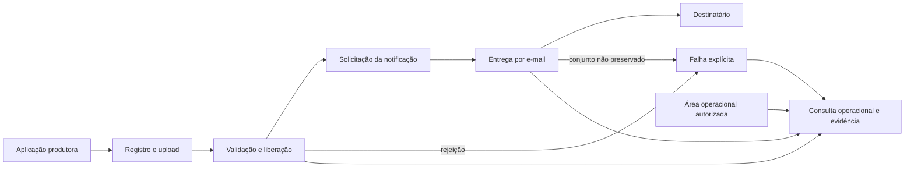

# PRD: Gestão de anexos do Notification Hub

**Tipo de documento**: documento de requisitos de produto (PRD)  
**Produto**: Notification Hub  
**Capacidade**: `AttachmentManagement`  
**Responsável pelo produto**: Produto Notification Hub  
**Público**: Produto, Engenharia, Segurança da Informação, Privacidade, Compliance e Operações  
**Propósito**: definir o problema, o escopo, os resultados observáveis e a aceitação de produto para notificações com anexos  
**Data de referência**: 2026-08-30  
**Status**: rascunho  
**Fontes principais**: decisões registradas neste PRD, comportamento implementado e design proposto do Notification Hub

Este documento é a fonte canônica para o problema, os objetivos, a jornada, o escopo, os requisitos e a aceitação de produto da gestão de anexos. Requisitos de engenharia, contratos, ADRs e desenhos técnicos devem consumir este PRD sem transferir detalhes de implementação para ele.

## Resumo

O Notification Hub passará a permitir que aplicações produtoras forneçam anexos para notificações por e-mail. A aplicação realizará um upload gerenciado pelo hub, aguardará a liberação do arquivo e usará uma referência opaca ao solicitar a notificação. O arquivo não será enviado dentro da solicitação de notificação nem transportado por Kafka ou SQS.

A capacidade centraliza integridade, isolamento, validação de segurança, preservação enquanto a notificação depender do arquivo e rastreabilidade. Ela permite que o hub relacione o conteúdo validado ao conteúdo submetido ao provedor, sem exigir um fluxo de documentos separado para a jornada coberta.

A primeira produção prioriza falha fechada, prova do conteúdo enviado e compatibilidade com produtores existentes. Suporte a outros canais, ingestão inline e importação de objetos externos permanecem fora desse primeiro escopo.

## Problema

- **PROB-001**: aplicações produtoras não conseguem solicitar pelo Notification Hub uma notificação que inclua anexos. Quando a jornada exige comprovantes ou documentos, o produtor precisa omitir o arquivo ou realizar a entrega fora da capacidade central.
- **PROB-002**: sem gestão central de anexos, o hub não consegue aplicar de modo uniforme isolamento, validação, integridade e evidência ao arquivo associado à notificação. Também não consegue demonstrar que os bytes submetidos ao provedor correspondem aos bytes previamente validados.

O comportamento atual confirma a ausência da capacidade: o contrato de integração declara que o hub não aceita anexos, o [comando de ingresso](../src/Platform.Api/Modules/Notifications/Features/Ingress/RequestNotification/RequestNotification.Command.cs#L7) não possui referências de arquivos e o [modelo de e-mail](../src/Platform.Api/Modules/Dispatch/Integration/V1/RenderedMessage.cs#L23) contém apenas conteúdo textual. Consulte também o [Guia de integração do produtor](guia-integracao-produtor.md), `docs/guia-integracao-produtor.md:215`.

Se a capacidade permanecer ausente, o hub continuará incapaz de concluir essa jornada e de oferecer uma evidência uniforme sobre o arquivo submetido ao provedor.

## Baseline brownfield observado

| Superfície | Comportamento preservado | Evidência |
|---|---|---|
| REST | Forma da solicitação, autorização e resultados síncronos de aceite, replay, conflito e recusa | [Contrato REST](guia-integracao-produtor.md#L44) e [ordem dos resultados](guia-integracao-produtor.md#L110) |
| Kafka | Forma do evento, autorização do produtor, rejeição em dead-letter e coexistência de versões de esquema | [Contrato Kafka](guia-integracao-produtor.md#L147), [evolução do esquema](guia-integracao-produtor.md#L176) e [autorização](guia-integracao-produtor.md#L195) |
| Idempotência | Escopo por `application`, replay sem novo efeito e conflito para conteúdo diferente | [Semântica vigente](guia-integracao-produtor.md#L250) |
| Eventos de resultado | Eventos terminais de rejeição, falha e entrega | [Eventos de saída](guia-integracao-produtor.md#L407) |
| Seleção de canal | Canal e ordem de fallback definidos pela política publicada | [Decisões do hub](guia-integracao-produtor.md#L333) |
| Ausência de anexos | Solicitação e conteúdo de e-mail sem referências ou bytes de anexos; barramento limitado a mensagens sem anexos | [Comando atual](../src/Platform.Api/Modules/Notifications/Features/Ingress/RequestNotification/RequestNotification.Command.cs#L7), [conteúdo atual de e-mail](../src/Platform.Api/Modules/Dispatch/Integration/V1/RenderedMessage.cs#L23) e [restrição do barramento](guia-integracao-produtor.md#L210) |

## Objetivos de produto

- **GOAL-001**: permitir que uma aplicação autorizada associe anexos fornecidos por ela a uma notificação por e-mail sem transportar o conteúdo na solicitação da notificação.
- **GOAL-002**: garantir que somente anexos liberados, íntegros e pertencentes à aplicação solicitante possam ser usados.
- **GOAL-003**: preservar o conjunto completo de anexos durante tentativas, falhas e auditoria, sem degradação silenciosa do conteúdo solicitado.

## Não objetivos

- Gerar, converter, editar, assinar ou extrair conteúdo de documentos.
- Aceitar uma localização arbitrária no S3 ou manter a custódia do arquivo em infraestrutura da aplicação cliente.
- Receber bytes ou base64 no contrato de solicitação de notificação.
- Entregar anexos por SMS, push ou WhatsApp na primeira produção.
- Substituir anexos por links de download quando o canal não os suportar.
- Gerenciar anexos estáticos que façam parte da autoria de templates.
- Criar um portal público de compartilhamento ou download de arquivos.
- Definir bucket, chave, URL de upload, IAM, KMS, versionamento, tabelas, eventos internos, scanner ou estratégia de streaming.

## Atores

- **Aplicação produtora**: fornece o arquivo, acompanha sua liberação e solicita a notificação com uma referência opaca.
- **Destinatário**: é o endereço da entrega por e-mail que contém o conjunto de anexos solicitado.
- **Produto Notification Hub**: define o comportamento, os canais e os critérios de aceitação da capacidade.
- **Área operacional autorizada**: acompanha estados, falhas e evidências sem acessar conteúdo além das permissões aplicáveis.

## Jornada de produto

- **JRN-001**: a aplicação produtora registra o arquivo, realiza o upload, acompanha sua validação e solicita uma notificação usando a referência liberada. O hub aceita a notificação somente quando todos os anexos estão liberados e, em uma tentativa aceita pelo provedor, submete exatamente o conjunto solicitado para entrega por e-mail. Caso isso não seja possível, a aplicação recebe um resultado explícito sem degradação do conteúdo.
- **JRN-002**: uma área operacional autorizada investiga uma notificação e relaciona a aplicação solicitante, a identidade e a integridade dos anexos, o resultado da validação, a tentativa de envio e a resposta do provedor, sem depender do conteúdo bruto em logs ou eventos.

## Direção de produto deste PRD

| Decisão | Direção | Trade-off aceito |
|---|---|---|
| Ingresso do arquivo | Upload gerenciado pelo hub, seguido de referência opaca | A aplicação executa um fluxo em várias etapas e precisa aguardar a liberação antes de pedir a notificação |
| Custódia | Armazenamento sob controle do hub, com Amazon S3 como restrição declarada | O hub assume armazenamento, proteção, validação, reconciliação e descarte |
| Momento do aceite | A notificação só é aceita após todos os anexos estarem liberados | O produtor espera a conclusão da validação, enquanto o hub evita notificações retidas por arquivos pendentes |
| Canal inicial | Somente e-mail | A primeira produção não cobre documentos por WhatsApp nem conversão para links em outros canais |
| Fallback incompatível | Encerrar com falha explícita | A entrega pode alcançar menos canais, mas nunca remove anexos silenciosamente |

A alternativa de conteúdo inline foi adiada. Ela poderá ser reavaliada como uma fachada de ingresso para arquivos pequenos se evidências futuras demonstrarem que aplicações produtoras não conseguem operar o fluxo em várias etapas. A importação de objetos mantidos no S3 da aplicação cliente também foi adiada porque disponibilidade, autorização, proteção e retenção deixariam de estar integralmente sob controle do hub.

## Escopo da primeira produção

- Registro de anexos sob a identidade da aplicação produtora.
- Upload gerenciado para armazenamento sob custódia do hub.
- Identificador público opaco para acompanhamento, que se torna utilizável pela notificação somente após a liberação.
- Estados observáveis de recebimento, validação, liberação, rejeição e descarte.
- Validação de integridade, tipo permitido e segurança antes da liberação.
- Associação de um conjunto de anexos liberados à solicitação de notificação.
- Associação das referências liberadas à semântica de idempotência da notificação.
- Entrega do conjunto completo por e-mail.
- Falha explícita quando o conjunto não puder ser preservado.
- Evidência do ciclo de vida e do resultado da entrega.
- Preservação enquanto uma notificação ativa puder depender do anexo.
- Compatibilidade para produtores que continuam solicitando notificações sem anexos.

## Requisitos funcionais de produto

### Registro e liberação

- O produto deve permitir que uma aplicação autorizada inicie o envio de um conjunto de anexos sob sua própria identidade.
- O produto deve fornecer um identificador opaco para acompanhamento sem revelar localização, credenciais ou detalhes internos de armazenamento.
- O produto deve apresentar um estado compreensível para que a aplicação saiba se o anexo ainda está em processamento, foi liberado ou foi rejeitado.
- O produto deve tornar o identificador utilizável em uma notificação somente depois de comprovar a integridade do anexo e concluir as validações de segurança aplicáveis.
- O produto deve manter fechado o gate de liberação quando a validação estiver indisponível ou for inconclusiva.
- O produto deve recusar conteúdo cujo tipo real não corresponda ao declarado, que não possa ser inspecionado com segurança ou que não possa ser entregue dentro do envelope efetivo do provedor.
- O produto deve recusar metadados hostis, conteúdo protegido que impeça a inspeção e estruturas que excedam a capacidade segura de validação.
- O produto deve fornecer um motivo estável e seguro para rejeição, sem expor conteúdo nem informação utilizável para acesso ao armazenamento.

### Associação e aceite da notificação

- O produto deve aceitar uma notificação com anexos somente quando todas as referências estiverem liberadas, pertencerem à aplicação solicitante e forem usadas por um principal autorizado para essa aplicação.
- O produto deve recusar o uso de uma referência inexistente, rejeitada ou pertencente a outra aplicação.
- O produto deve tratar o conjunto de referências e todas as propriedades de anexo que alteram a entrega como parte do conteúdo idempotente da solicitação.
- O produto deve reconhecer como replay uma solicitação repetida com a mesma chave, as mesmas referências e as mesmas propriedades de entrega, sem produzir novo efeito.
- Um replay de uma solicitação anteriormente aceita deve devolver o resultado original sem reavaliar o estado atual do anexo nem criar uma nova entrega.
- O produto deve responder com conflito quando a mesma chave idempotente for reapresentada com referência ou propriedade de entrega diferente.

### Entrega por e-mail e fallback

- O produto deve submeter ao provedor de e-mail todos os anexos aceitos, preservando conteúdo, nome de exibição e tipo liberados.
- O produto deve relacionar os bytes enviados ao provedor à identidade íntegra validada antes do aceite.
- O produto deve rejeitar antes da chamada ao provedor um conjunto que não caiba no envelope efetivo de entrega.
- O produto deve verificar antes de cada tentativa que a liberação de segurança permanece válida; uma validação vencida ou revogada impede a chamada ao provedor e produz resultado explícito.
- O produto nunca deve remover um anexo para tornar uma tentativa elegível.
- O produto deve encerrar com resultado explícito e auditável quando nenhuma tentativa por e-mail puder preservar o conjunto completo.
- O produto não deve substituir automaticamente anexos por links ou por uma mensagem sem arquivos.

### Ciclo de vida, evidência e operação

- O produto deve preservar o anexo enquanto ele puder ser necessário para agendamento, tentativa, retry, fallback, reconciliação ou evidência da submissão ao provedor.
- O produto deve impedir descarte enquanto uma notificação ativa depender do anexo.
- O produto deve identificar uploads abandonados e descartá-los sem afetar anexos vinculados a notificações ativas.
- O produto deve permitir que uma área autorizada relacione anexo, validação, notificação, tentativa e provedor sem obter o conteúdo por superfícies operacionais comuns.
- O produto deve registrar alterações relevantes do ciclo de vida e acessos administrativos auditáveis.
- O produto deve manter conteúdo bruto, localizações de armazenamento e capacidades de upload fora de Kafka, SQS, outbox, dead-letter, eventos, logs e detalhes comuns de auditoria.

### Compatibilidade

- O produto deve preservar o comportamento das solicitações existentes que não informam anexos.
- O produto deve manter o contrato atual sem anexos disponível durante qualquer transição que não seja comprovadamente compatível.
- Para solicitações sem anexos, a compatibilidade deve abranger o [baseline brownfield observado](#baseline-brownfield-observado) para REST, Kafka, idempotência, recusas, eventos de resultado e seleção de canal.
- O produto deve publicar resultados de falha e rejeição de modo que produtores possam distinguir erro de referência, validação, autorização, limite e entrega.

## Requisitos não funcionais de produto

### Segurança e privacidade

- Somente principais autorizados para uma aplicação podem registrar, acompanhar ou usar seus anexos.
- A referência pública não pode permitir enumeração prática nem revelar informação de acesso ao armazenamento.
- O conteúdo deve permanecer protegido durante upload, custódia, validação e entrega ao provedor.
- O arquivo liberado deve permanecer imutável para o fluxo de entrega. O arquivo entregue deve ser verificavelmente igual ao arquivo validado.
- Conteúdo infectado, não verificável ou inconclusivo não pode chegar ao provedor.
- A validade da liberação deve ser verificável no momento da tentativa; uma liberação vencida ou revogada falha fechada.
- Nomes, tipos e demais metadados devem seguir minimização e não podem aparecer em logs ou erros além do necessário e permitido.

### Confiabilidade

- Uma falha parcial entre upload, validação, persistência e liberação deve resultar em estado recuperável ou descarte conhecido, nunca em anexo utilizável sem validação.
- Reprocessamentos não podem duplicar a liberação, a associação nem a tentativa de entrega.
- Indisponibilidade temporária do armazenamento, da proteção criptográfica, da validação ou do provedor não pode provocar envio sem anexo nem avanço incorreto de estado.
- O descarte não pode tornar irrecuperável um anexo ainda necessário para uma notificação aceita.

### Experiência da aplicação produtora

- A aplicação deve conseguir distinguir upload pendente, anexo liberado, rejeição recuperável e rejeição definitiva.
- O fluxo deve permitir repetição segura das operações após timeout ou resposta perdida.
- Mensagens de erro devem orientar a próxima ação sem expor conteúdo, localização de armazenamento ou detalhes sensíveis da validação.

### Operação e observabilidade de produto

- A operação autorizada deve conseguir acompanhar volume recebido, rejeições, backlog de validação, uploads abandonados, falhas de entrega e descarte.
- Alertas e relatórios devem identificar a aplicação e o estado do fluxo por referências opacas, sem conteúdo bruto.
- A capacidade deve fornecer evidência suficiente para investigar divergência entre o manifesto aceito e o conteúdo submetido ao provedor.

## Métricas de sucesso e critérios de aceitação

### Métricas

| ID | Métrica e população | Cálculo | Meta | Janela de verificação |
|---|---|---|---|---|
| `MET-001` | Conclusão da jornada válida em todos os casos de ponta a ponta da suíte de aceitação | casos que chegam à aceitação do provedor com o conjunto correto ÷ todos os casos válidos executados | 100% | cada candidato a release |
| `MET-002` | Violações do gate de segurança em todos os casos negativos obrigatórios | casos com referência não liberada, vencida, revogada, hostil ou não autorizada que alcançam o provedor | 0 | cada candidato a release |
| `MET-003` | Degradações silenciosas em todos os cenários de roteamento e fallback da suíte | tentativas que removem ou alteram o conjunto aceito | 0 | cada candidato a release |
| `MET-004` | Exposições nas superfícies coletadas durante toda a suíte de aceitação | ocorrências de bytes, localização S3 ou capacidade de upload em Kafka, SQS, dead-letter, logs ou auditoria comum | 0 | cada candidato a release |
| `MET-005` | Reconstrução de todas as tentativas de teste aceitas pelo provedor | tentativas que relacionam referência, integridade, validação e submissão ÷ todas as tentativas aceitas pelo provedor | 100% | cada candidato a release |
| `MET-006` | Violações de isolamento em todos os casos da matriz entre aplicações | casos em que uma aplicação consulta ou usa referência de outra | 0 | cada candidato a release |
| `MET-007` | Regressões em toda a suíte vigente de solicitações sem anexos por REST e Kafka | cenários cujo resultado observável diverge do [baseline brownfield observado](#baseline-brownfield-observado) | 0 | cada candidato a release |

### Critérios de aceitação de produto

- **PAC-001**: uma aplicação autorizada inicia o upload, acompanha a validação por um identificador opaco e só consegue usar esse identificador em uma notificação depois da liberação.
- **PAC-002**: uma solicitação com referência pendente, rejeitada ou inexistente é recusada antes de criar uma notificação aceita.
- **PAC-003**: uma tentativa bem-sucedida submete ao provedor de e-mail todos os anexos solicitados, e a evidência demonstra que os bytes submetidos correspondem aos bytes validados.
- **PAC-004**: uma aplicação não consegue consultar nem usar uma referência pertencente a outra aplicação.
- **PAC-005**: um arquivo infectado, não verificável ou com resultado inconclusivo nunca é liberado nem enviado.
- **PAC-006**: quando o e-mail não puder preservar o conjunto completo, o fluxo termina com falha explícita e auditável, sem mensagem degradada em outro canal.
- **PAC-007**: uma consulta autorizada relaciona aplicação, anexo, integridade, validação, notificação, tentativa e provedor sem depender de conteúdo bruto em logs ou eventos.
- **PAC-008**: produtores existentes continuam solicitando notificações sem anexos por REST e Kafka, preservando os comportamentos enumerados no [baseline brownfield observado](#baseline-brownfield-observado).
- **PAC-009**: repetir a mesma chave idempotente com as mesmas referências e propriedades devolve o resultado original; alterar uma referência ou propriedade de entrega produz conflito e nenhum novo efeito.
- **PAC-010**: uma falha parcial em upload, validação ou liberação converge para estado recuperável ou descarte conhecido, sem produzir anexo utilizável sem validação.
- **PAC-011**: o descarte de upload abandonado não remove nem torna indisponível um anexo ainda vinculado a uma notificação ativa.
- **PAC-012**: a inspeção das superfícies produzidas pela suíte não encontra conteúdo bruto, localização S3 nem capacidade de upload em brokers, dead-letter, logs ou auditoria comum.
- **PAC-013**: uma liberação vencida ou revogada antes da tentativa impede a chamada ao provedor e produz resultado explícito.
- **PAC-014**: conteúdo com tipo divergente, metadado hostil ou estrutura não inspecionável é recusado sem liberar o anexo e sem expor o conteúdo na resposta.

## Hub de capacidades

| ID | Capacidade | Ator e valor | Origem | Prioridade de negócio | Depende de | Bloqueia | Aceitação |
|---|---|---|---|---|---|---|---|
| `CAP-001` | Registro, upload e referência opaca | Aplicação produtora fornece um arquivo sem expor o armazenamento aos demais fluxos | `PROB-001`, `GOAL-001`, `JRN-001` | P0 | nenhuma | `CAP-002` | `PAC-001`, `PAC-004`, `PAC-011` |
| `CAP-002` | Validação e liberação segura | Aplicação sabe quando o arquivo pode ser usado; destinatário fica protegido de conteúdo não liberado | `PROB-002`, `GOAL-002`, `JRN-001` | P0 | `CAP-001` | `CAP-003`, `CAP-005` | `PAC-002`, `PAC-005`, `PAC-013`, `PAC-014` |
| `CAP-003` | Associação e aceite idempotente | Aplicação associa referências liberadas sem duplicar efeitos nem cruzar isolamento | `PROB-001`, `PROB-002`, `GOAL-001`, `GOAL-002`, `JRN-001` | P0 | `CAP-002` | `CAP-004` | `PAC-002`, `PAC-004`, `PAC-008`, `PAC-009` |
| `CAP-004` | Submissão completa por e-mail | Aplicação obtém resultado explícito da submissão do conjunto completo ao provedor | `PROB-001`, `PROB-002`, `GOAL-001`, `GOAL-003`, `JRN-001` | P0 | `CAP-003` | `CAP-005` | `PAC-003`, `PAC-006`, `PAC-013` |
| `CAP-005` | Ciclo de vida, operação e evidência | Área operacional autorizada acompanha proteção, entrega, recuperação e descarte | `PROB-002`, `GOAL-003`, `JRN-002` | P0 | `CAP-002`, `CAP-004` | nenhuma | `PAC-007`, `PAC-010`, `PAC-011`, `PAC-012` |

## Dependências e ondas de execução

| Capacidade | Razão da dependência | Habilitada por | Onda de execução | Paralela com segurança a |
|---|---|---|---|---|
| `CAP-001` | Estabelece a identidade e o ingresso do anexo | nenhuma | 1 | nenhuma |
| `CAP-002` | Precisa de um anexo registrado para validar e liberar | `CAP-001` | 2 | nenhuma |
| `CAP-003` | Só pode aceitar referências cuja identidade e liberação existam | `CAP-002` | 3 | nenhuma |
| `CAP-004` | Precisa de um conjunto aceito e vinculado à notificação | `CAP-003` | 4 | nenhuma |
| `CAP-005` | Precisa dos resultados de validação e submissão para completar a investigação e a recuperação | `CAP-002`, `CAP-004` | 5 | nenhuma |

Prioridade de negócio não define sozinha a ordem técnica. As ondas representam dependências de capacidades, não tarefas de implementação.

## Integração entre capacidades

| De | Para | Transferência ou estado compartilhado | Comportamento de ponta a ponta | Aceitação |
|---|---|---|---|---|
| `CAP-001` | `CAP-002` | Identidade opaca e conteúdo recebido | A validação examina o conteúdo associado à identidade registrada | `PAC-001`, `PAC-005` |
| `CAP-002` | `CAP-003` | Referência liberada e integridade comprovada | Somente referências liberadas podem participar do aceite da notificação | `PAC-002`, `PAC-004` |
| `CAP-003` | `CAP-004` | Conjunto idempotente associado à notificação | A submissão recebe exatamente o conjunto aceito e não o degrada | `PAC-003`, `PAC-006`, `PAC-009` |
| `CAP-002` | `CAP-005` | Resultado da validação e transições de estado | A investigação relaciona liberação ou rejeição ao anexo correto | `PAC-005`, `PAC-007` |
| `CAP-004` | `CAP-005` | Tentativa, provedor e resultado | A investigação reconstrói o manifesto submetido e o desfecho da tentativa | `PAC-007` |

## Rastreabilidade do produto

| Problema | Objetivo | Jornada | Capacidade | Aceitação de produto |
|---|---|---|---|---|
| `PROB-001` | `GOAL-001` | `JRN-001` | `CAP-001` | `PAC-001`, `PAC-004`, `PAC-011` |
| `PROB-002` | `GOAL-002` | `JRN-001` | `CAP-002` | `PAC-002`, `PAC-005`, `PAC-013`, `PAC-014` |
| `PROB-001`, `PROB-002` | `GOAL-001`, `GOAL-002` | `JRN-001` | `CAP-003` | `PAC-004`, `PAC-008`, `PAC-009` |
| `PROB-001`, `PROB-002` | `GOAL-001`, `GOAL-003` | `JRN-001` | `CAP-004` | `PAC-003`, `PAC-006` |
| `PROB-002` | `GOAL-003` | `JRN-002` | `CAP-005` | `PAC-007`, `PAC-010`, `PAC-012` |

## Premissas e restrições

- O conteúdo é fornecido pela aplicação produtora; o hub não o gera.
- Amazon S3 é uma restrição declarada para a custódia, sem determinar neste PRD a organização física ou os controles técnicos do armazenamento.
- O contrato atual usa `application` para identificar a aplicação dona do template e para delimitar idempotência e autorização no Kafka, conforme o [baseline brownfield observado](#baseline-brownfield-observado). Nesta capacidade, cada referência de anexo só pode ser usada por um principal autorizado para a respectiva `application`.
- O fluxo de upload ocorre antes da solicitação da notificação e pode exigir acompanhamento de estado pela aplicação.
- O conteúdo bruto não trafega nos brokers. As mensagens carregam somente referências necessárias ao processamento.
- O suporte inicial é exclusivo para e-mail e não altera a elegibilidade atual dos demais canais para notificações sem anexos.

## Riscos de produto

| Risco | Consequência | Resposta de produto |
|---|---|---|
| Aplicações não conseguem operar o fluxo em várias etapas | Baixa adoção ou criação de integrações paralelas | Medir a jornada dos produtores; reavaliar uma fachada de ingresso inline apenas se a necessidade for comprovada |
| Validação demora ou fica indisponível | A notificação não pode ser solicitada com o anexo | Expor estado e motivo seguros; manter falha fechada e repetição segura |
| Conteúdo não cabe no envelope aceito pelo provedor | Rejeição tardia ou pressão operacional | Avaliar o envelope completo e rejeitar antes da chamada ao provedor |
| Descarte ocorre enquanto a notificação ainda depende do anexo | Retry, fallback ou auditoria não consegue acessar o arquivo | Impedir o descarte enquanto houver dependência ativa e verificar essa proteção por `PAC-011` |
| Metadados ou capacidades de acesso aparecem em superfícies operacionais | Exposição indevida ou acesso não autorizado | Aplicar minimização, varredura de vazamento e referências opacas em todas as superfícies |
| Falha parcial deixa arquivo sem estado coerente | Arquivo órfão ou conteúdo não validado pode permanecer no fluxo | Exigir recuperação observável ou descarte conhecido antes de permitir uso |
| Validação produz falso positivo, falso negativo ou resultado inconclusivo | Arquivo legítimo é bloqueado ou conteúdo hostil é liberado | Manter resultado inconclusivo fechado, registrar o desfecho e medir a eficácia da validação |
| Liberação vence ou é revogada antes da tentativa | Conteúdo deixa de atender ao gate que permitiu o aceite | Revalidar o estado antes da chamada e terminar explicitamente quando ele não for válido |
| Principal tenta usar referência de outra aplicação | Exposição indevida entre domínios produtores | Recusar sem revelar a existência ou os dados do anexo e registrar evidência segura |
| Evolução do contrato quebra produtores atuais | Regressão em solicitações sem anexos | Preservar o [baseline brownfield observado](#baseline-brownfield-observado) e manter coexistência quando a mudança não for compatível |
| Resposta do provedor não comprova recebimento pelo destinatário | Evidência pode ser interpretada além do que o hub observa | Declarar a prova no limite da submissão e do resultado retornado pelo provedor |

## Governança e aprovação

- **Responsável pelo produto**: Produto Notification Hub.
- **Consumidores diretos**: aplicações produtoras e destinatários de notificações por e-mail.
- **Aprovação do escopo**: responsável pelo Produto Notification Hub.
- **Condição de aceitação do produto**: critérios e métricas deste PRD atendidos no candidato a release.

## Relação com artefatos posteriores

- Requisitos de engenharia devem traduzir os resultados deste PRD em fronteiras, contratos, qualidade e verificações mensuráveis.
- ADRs devem decidir o modelo concreto de upload, integridade, custódia, proteção, versionamento e compatibilidade pública.
- O contrato deve definir formas de solicitação, estados, recusas, idempotência e coexistência de versões.
- O desenho técnico deve definir máquina de estados, persistência, reconciliação, validação, entrega ao provedor, observabilidade e descarte.
- A estratégia de qualidade deve cobrir autorização cruzada, troca de conteúdo, arquivos hostis, falhas parciais, replay, fallback, vazamentos e regressão de produtores sem anexos.

## Fontes

- [Direções de produto registradas neste PRD](#direção-de-produto-deste-prd), consolidadas em 2026-08-30.
- Parecer da mesa redonda consultiva com `dotnet-architect`, `dotnet-engineer` e `dotnet-specialist`, incorporado às [direções de produto deste PRD](#direção-de-produto-deste-prd), sem efeito de aprovação ou alteração de código.
- [Notification Hub: design de sistema](notification-hub-system-design.md), especialmente objetivos, claim check, isolamento por aplicação, auditoria e contratos de integração.
- [Guia de integração do produtor](guia-integracao-produtor.md), fonte do comportamento implementado e da ausência atual de anexos.
- [Fronteira do módulo Notifications](../src/Platform.Api/Modules/Notifications/AGENTS.md#L9), ciclo de vida, tentativas e fallback observados.
- [Fronteira do módulo Dispatch](../src/Platform.Api/Modules/Dispatch/AGENTS.md#L5), adaptadores de provedor observados.
- [Forma atual da solicitação](../src/Platform.Api/Modules/Notifications/Features/Ingress/RequestNotification/RequestNotification.Command.cs#L7).
- [Forma atual do conteúdo de e-mail](../src/Platform.Api/Modules/Dispatch/Integration/V1/RenderedMessage.cs#L23).
- [Forma atual da chamada ao SendGrid](../src/Platform.Api/Modules/Dispatch/Infrastructure/Providers/SendGrid/SendGridMailRequest.cs#L10).
- [Perfil observado da solução](../.araia/stack-profile.yaml#L4), incluindo .NET e arquitetura modular.
